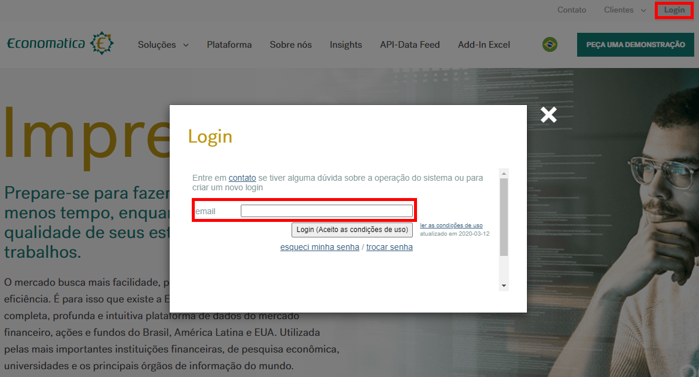
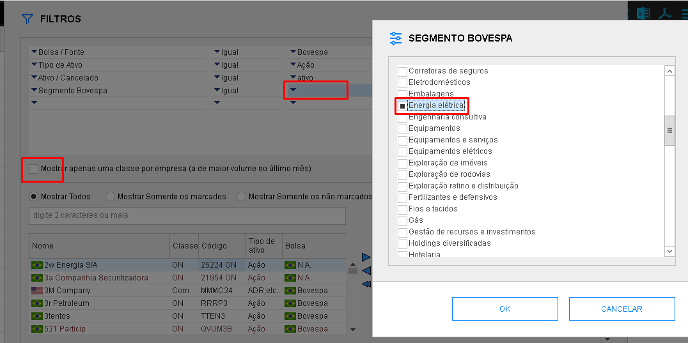
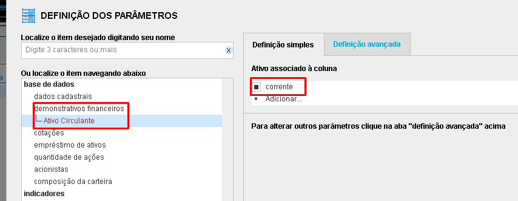
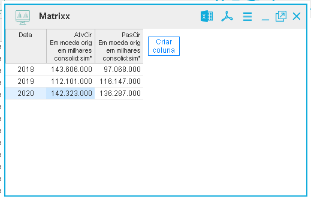

\newpage

```{r setup, include=FALSE}
knitr::opts_chunk$set(echo = TRUE, cache = FALSE, prompt = FALSE,
                      tidy = FALSE, comment = NA, message = FALSE,
                      warning = FALSE, fig.width=2, fig.height=4)
```

# PROJETO CONTABILIDADOS

Esse projeto se justifica pela oportunidade de sumarizar os dados públicos de entidades públicas e privadas para a sociedade em geral, levando informação de qualidade para acompanhamento da gestão. O simples fato de divulgar não torna as informações disponíveis relevantes para a sociedade. A partir do momento que se aproveita os preceitos de governança corporativa estimuladas pela Comissão de Valores Mobiliários (CVM), e as determinações legais advindas da Lei Complementar nº 101 (2000), popularmente conhecida como Lei de Responsabilidade Fiscal (LRF), da Lei Complementar nº 131 (2009) que alterou a LRF no que concerne a transparência, combinadas com a Lei nº 12.527 (2011) -- Lei de Acesso à Informação (LAI), que versa sobre o direito do cidadão ao acesso à informação, é possível tornar os dados dispersos em informações úteis aos cidadãos interessados nas finanças do Brasil.

Esse projeto, consiste, portanto, em acompanhar o desempenho e atividades de entidades públicas e privadas, por meio de consolidação de dados divulgados de forma dispersa, trazendo para a sociedade indicadores sumarizados sobre a gestão pública e corporativa no Brasil. Ao mesmo tempo cuida em manter bancos de dados disponíveis para futuras pesquisas de interesse público e privado com divulgação de índices de sentimento e indicadores.

### OBJETIVOS

-   Mapear bases de dados disponíveis na web;
-   Organizar a base central de dados orçamentários, financeiros, contábeis e de gestão de entidades públicas e privadas;
-   Criar rotina para tratamento dos dados;
-   Disponibilizar dados à comunidade;
-   Treinar docentes, discentes e membros da sociedade em geral com interesse em fazer uso da ciência de dados para avaliar a gestão pública e privada no Brasil.

### METODOLOGIA

Após mapear as fontes de dados disponíveis e confiáveis, serão direcionados os tipos de dados a serem explorados (financeiros, fiscais, previdenciários, gestão, dentre outros). Com base na definição dos dados a serem explorados será definida a política do observatório, iniciando com a criação de rotinas de extração, tratamento e divulgação dos dados.

Com a compreensão das rotinas e dados a serem explorados, serão definidas as equipes para estruturação das bases de dados, tendo como objetivo inicial a sumarização e "clusterização" dos dados. Para fins de benchmark de coleta estão repositórios públicos como por exemplo, na Secretaria do Tesouro Nacional, IBGE, Federação das Indústrias do Rio de Janeiro (FIRJAN), Fundo Nacional de Educação, Fundo Nacional da Saúde, RAIS, CAGED, Comissão de Valores Mobiliários (CVM), Brasil Bolsa Balcão (B3), entre outras.

A etapa seguinte consiste em calcular indicadores e/ou índices de gestão, contábil ou de sentimento, de forma a produzir informações individualizadas de entidades públicas e privadas, definindo o formato de divulgaçaõ dos dados (sumarizados ou microdados). Para essa etapa serão utilizados diversos softwares, tais como: R, Stata, Matlab, Power BI, Python e Excel. Nessa etapa se iniciam os treinamentos de alunos e professores para condução dos subprojetos, divididos por área de interesse a ser definida após tratamento dos dados. Ao final serão construídos os dicionários das bases de dados criadas e definidos os paineis para consulta de dados (dashboards) com o respectivo treinamento de alunos, professores e sociedade em geral.

**Mais informações** sobre o Projeto contabiliDados [**clique aqui**](dgp.cnpq.br/dgp/espelhogrupo/5876410881852665)

\newpage

# SOBRE ESTE TREINAMENTO

### EMENTA

Apresentação da plataforma Economatica. Utilização das ferramentas screener e matrix. Geração de bancos de dados em excel em séries temporais e dados em painel. Apresentação da plataforma R e R Studio. Operações básicas no R. Tipos de objeto. Importação de planilhas e dados externos. Geração de banco de dados. Estatística descrita com valores e gráficos.

### OBJETIVOS

-   Estimular os alunos a utilizar ferramentas de análise de dados em atividades relacionadas à área contábil;
-   Capacitar os alunos na ferramenta R Programming;
-   Abordar, na prática, conceitos de contabilidade, estatística e análise de dados.

### METODOLOGIA

Serão utilizados dados da plataforma Economatica para geração de indicadores contábeis básicos com o intuito de demonstrar usos básicos da plataforma R Programming. Os dados gerados serão importados, tratados e analisados, propiciando a interação entre os alunos e as ferramentas estudadas.

### MATERIAL COMPLEMENTAR

A apresentação desse treinamento pode ser acessada pelo canal do youtube do 
Projeto UFERSA3 - Liga de Mercado Financeiro da UFERSA:

Parte 1: [clique aqui](https://youtu.be/7mgmchEo-1w)

Parte 2: [clique aqui](https://youtu.be/Bckx1xIqGto)

>>> O canal do youtube também dispõe de vídeos com exploração de ferramentas básicas
e avançadas do Economatica.

>>> Acesse: [www.youtube.com/c/ProjetoUfersa3](www.youtube.com/c/ProjetoUfersa3)


\newpage

# EQUIPE RESPONSÁVEL

Prof. **Kléber Formiga** Miranda

&nbsp; [**E-mail** - mirandakf\@ufersa.edu.br](mailto:mirandakf@ufersa.edu.br) |
[**Lattes** - lattes.cnpq.br/5969359253746807](http://lattes.cnpq.br/%205969359253746807)

&nbsp; [**Github** - github.com/kleberformiga](https://github.com/kleberformiga) |
[**Linkedin** - br.linkedin.com/in/kleberformiga](https://br.linkedin.com/%20in/kleberformiga)

&nbsp;

Prof. **Lucas** Lúcio **Godeiro**

&nbsp; [**E-mail** - lucasgodeiro\@ufersa.edu.br](mailto:lucasgodeiro@ufersa.edu.br) |
[**Lattes** - lattes.cnpq.br/0903970970268664](http://lattes.cnpq.br/0903970970268664)

&nbsp; [**Github** - github.com/lucasgodeiro](https://github.com/lucasgodeiro) |
[**Linkedin** - br.linkedin.com/in/lucas-godeiro](https://www.linkedin.com/in/lucas-godeiro-a1b42567)

&nbsp;

Prof. **Alexsandro** Gonçalves da Silva **Prado**

&nbsp; [**E-mail** - alexsandro.prado\@ufersa.edu.br](mailto:alexsandro.prado@ufersa.edu.br) |
[**Lattes** - lattes.cnpq.br/4254857944224293](http://lattes.cnpq.br/4254857944224293)

&nbsp; [**Github** - github.com/alexsandroprado](https://github.com/alexsandroprado) |
[**Linkedin** - br.linkedin.com/in/alexsandroprado](https://www.linkedin.com/in/alexsandroprado)

&nbsp;

**Kewerson** Alves **Cunha**

&nbsp; [**E-mail** - kewerson.cunha\@alunos.ufersa.edu.br](mailto:kewerson.cunha@alunos.ufersa.edu.br) |
[**Linkedin** - br.linkedin.com/in/kewerson-alves-cunha](https://www.linkedin.com/in/kewerson-alves-cunha-15052000)

&nbsp;

**Tomaz** da Silva **Melo**

&nbsp; [**E-mail** - tomaz.melo\@alunos.ufersa.edu.br](mailto:tomaz.melo@alunos.ufersa.edu.br) |
[**Lattes** - lattes.cnpq.br/5153159638802664](http://lattes.cnpq.br/5153159638802664)

&nbsp; [**Github** - github.com/TomazMelo](https://github.com/TomazMelo) |
[**Linkedin** - br.linkedin.com/in/tomaz-melo](https://br.linkedin.com/in/tomaz-melo-680999222)

&nbsp;

**Isabele** Vieira de **Matos**

&nbsp; [**E-mail** - isabele.matos\@alunos.ufersa.edu.br](Isabele.matos@alunos.ufersa.edu.br) |
[**Lattes** - lattes.cnpq.br/3188106686594869](http://lattes.cnpq.br/3188106686594869)

&nbsp; [**Linkedin** - br.linkedin.com/in/isabele-matos](https://www.linkedin.com/in/isabele-matos-b13602196)

\newpage


# ECONOMATICA

A Economatica é constantemente alimentada com os dados mais recentes do mercado
financeiro e permite ao usuário manipular um grande volume de dados, encontrá-los
facilmente e capturá-los sem estresse para fazer simulações avançadas e comparar
ativos com maior facilidade e eficiência. Tudo isso, para oferecer uma visão mais
ampla e melhor subsídio para produzir melhores análises, realizar melhores 
relatórios e obter melhores insights, enquanto economiza tempo de suas equipes.
(Fonte: [Site Economatica, 2022](https://economatica.com/plataforma-financeira)).

Neste treinamento, vamos mostrar como acessar o economatica para realizar uma
tarefa simples: coletar o Ativo Circulante (AC) e o Passivo Circulante (PC) de
empresas do setor elétrico para cálculo da liquidez corrente (AC/PC). A proposta
é demonstrar o passo a passo para coletar dados contábeis na plataforma
Economatica, gerando um banco de dados em excel com arquivo no formato CSV, em
formato de painel.

O formato painel é comumente usado em pesquisas da área contábil. Essencialmente,
dispor os dados em painel significa que teremos uma variável (coluna) com o 
código da empresa (*id* ou individuo), outra com o tempo (*t*) e as demais
variáveis de interesse. No caso desse treinamento, o ativo circulante e o passivo
circulante. Os dados ficarão assim:

|  cod  | ano  | ativoCirc | passivoCirc |
|:-----:|:----:|:---------:|:-----------:|
| ABCD3 | 2018 |  123.415  |   100.280   |
| ABCD3 | 2019 |  100.420  |   104.718   |
| ABCD3 | 2020 |  101.213  |   99.530    |
| XYKW3 | 2018 |  52.400   |   40.313    |
| XYKW3 | 2019 |  77.681   |   76.990    |
| XYKW3 | 2020 |  43.520   |   49.333    |

Observe que as empresas ABCD3 e XYKW3 aparecem empilhadas na coluna *cod* e 
possuem os anos de 2018 a 2020 na coluna *ano*, seguidos dos valores das
variáveis de interesse: Ativo Circulante (ativoCirc) e Passivo Circulante
(passivoCirc). Essa disposição de dados em uma tabela é denominada "Dados em
Painel". Embora existam outras disposições para esses dados, escolhemos esse
formato por ser mais usual.

## Coletando os dados

**Passo 1:** Acessar a plataforma Economatica



Conforme pode ser visto na figura acima, após o usuário acessar o site
[*www.economatica.com*](www.economatica.com), clica em *Login* para que apareça
uma tela com o *email* e o *botão* para realizar o login. O *email* informado
deverá ser o do usuário para controle de acesso. O acesso é livre dentro das
dependências da UFERSA. Pelo contrato vigente, qualquer máquina dentro do IP da 
UFERSA terá acesso ao economatica (limite de 50 acessos simultâneos).

**Passo 2:** Tela Inicial


Após login, aparecerá a tela inicial. Neste treinamento, vamos nos concentrar em 
duas opções: Screening e Matrix (ver destaque). Vamos iniciar pelo Screening.

**Passo 3:** Screening - Escolha da Tela Pré-Formatada


O Economatica dispõe de várias de várias telas pré-formatadas. Vamos usar o
screening pré-formatado "Básico". Nesse screening serão selecionadas as empresas
que *negociam ações na B3* (Brasil, Bolsa, Balcão) e que *estejam ativas*. Basta
escolhar a aba "Ações" e clicar no botão "ABRIR", conforme figura acima.

**Passo 4:** Screening - Escolha de dados


Após aberto o screening, clica na opção "Criar Coluna" para que apareça a
janela com várias opções. Vamos usar a opção "Dados Cadastrais".

**Passo 5:** Screening - Seleciona Segmento


Clica em "Dados Cadastrais" -> "Ações -> "Segmento Bovespa".

Com essa sequência, será incluída uma coluna "Segmento Bovespa" na qual constarão
o segumento de cada empresa selecionada no screening básico, conforme figura a
seguir.

**Passo 6:** Screening - Filtra Segmento


Como a proposta é estudar empresas do setor elétrico, vamos filtrar apenas
empresas do segmento "Energia Elétrica". Para isso, basta clicar com o botão
direito do mouse no título da coluna "Segmento Bovespa" e escolhar a opção do
menu "Inserir filtro baseado nesta coluna". Aparecerá a seguinte tela:



O primeiro procedimento nesta tela é clicar na opção "Mostrar apenas uma 
classe por empresa (a de maior volume no último mês)". Esta opção faz com que
seja apresentada apenas um código por empresa (o de maior de negociação no mês
anterior). Como estamos coletando dados contábeis, essa opçao faz sentido, já
que o ativo circulante da PETR3 é o mesmo que o da PETR4 em cada ano. Essa opção
não faz sentido quando coletarmos dados referente a negociações, como preço e 
volume, pois cada papel (PETR3 e PETR4, por exemplo) tem valores diferentes,
diariamente. Assim, selecionaremos essa opção (basta clicar).

O segundo procedimento é abrir a listBox do filtro da coluna "Segmento Bovespa".
Após clicar no listBox, aparecerá a janela da figura acima. Selecionaremos o
segmento "Energia Elétrica".

Após clicar "OK", o screening terá apenas um código por empresas e apenas as
empresas do segmento "Energia Elétrica", conforme figura abaixo:


É possível observar a lista de empresas apenas do segmento selecionado e apenas
uma classe por empresa. Temos, portanto, a lista de empresas definidas para
este treinamento: empresas do setor elétrico.

**Passo 7:** Matrix - Estrutura

Sem fechar o screening, escolha outro serviço clicando no botão com sinal de "+"
indicado na figura abaixo:


Voltaremos para a tela mostrada no *Passo 2*. Selecione Matrix. Deverá aparecer uma tela, conforme abaixo:


Essa é a estrutura de um matrix vazio. É possível observar que já há a coluna 
"Data" e a opção de "Criar coluna". Na coluna "Data", teremos a série de tempo
na frequência que escolhermos (diária, mensal, trimestral, anual). Essa escolha
é feita clicando no botão com três traços (em destaque). Esse é o primeiro
procedimento dessa etapa. Clique no botão com três traços para aparecer a tela
abaixo:


Podemos escolher, dentre outras opções, o período inicial e final da série e a
frequência. Neste exemplo, escolhemos como inicio 01/01/2018 e fim 31/12/2020.
A frequência escolhida foi em "Anos" (anual). Clica em "OK". Após essa
configuração, a coluna "Data" do matrix passará a ter a frequência anual, no
período estabelecido.


**Passo 8:** Matrix - Configuração da conta

Após configurada a coluna "Data", vamos configura a coluna da conta. Clique em
"Criar Coluna" para aparecer a tela abaixo:


A configuração consistem em escolher a conta desejada. Na figura acima estamos
selecionando a conta "Ativo Circulante", conforme essa sequência:

clique em "demonsrativos financeiros" -> IndComBR -> Ativo Circulante

Após clicar em "Ativo Circulante", aparecerá a tela abaixo:



Deixe a opção "corrente" selecionada. Isso servirá para gerarmos o banco de dados
pretendido. Clique em "OK" e o resultado final será:



Observamos a coluna "Data" com o período de 2018 a 2020, conforme configuração.
Na tela acima, além do Ativo Circulante (AtvCir) também vemos a conta (coluna)
com Passivo Circulante (PasCir). Para inclusão do Passivo Circulante, repita os
mesmos procedimentos utilizados para selecionar o Ativo Circulante (Passo 8). 
Como deixamos a opção "corrente" marcada, passaremos para a exportação dos dados 
para o excel.

**Passo 9:** Exportação

Na tela do Matrix, clique no botão com três traços (destaque) e clique na opção
"Exportar (XLS, XLSX, PDF, TXT, CSV, JSON)".


Após clicar, aparecerá a seguinte tela:


Neste exemplo, vamos gerar um arquivo com extensão "CSV". Seguindo a sequência
da tela acima:

1. Selecione o formato "csv"
2. Defina um nome para o arquivo (veja que já tem a extensão na frente do campo).
Será salvo um arquivo com nome "arquivoTreinamento.csv".
3. Selecione a opção "Para todos os ativos da janela screening (não fechamos o
screening para que essa opção fosse usada, coletando os dados de todas as
empresas do setor elétrico, conforme nossa configuração do screening)
4. Selecione "Todos ativos em um único arquivo" para que fique tudo em um só
arquivo csv (todo o banco de dados em um só arquivo).


**Passo 10:** Visualiza o banco de dados no excel

Verifique em qual pasta do seu computador o Economatica salvou o arquivo com o
nome indicado (nosso exemplo foi "arquivoTreinamento.csv") e o abra. O resultado
é apresentado na figura abaixo:


É um arquivo cujas colunas são separadas por vírgulas. Então temos a coluna
"Ativo" com os códigos da empresas (o texto <XBSP> vem na configuração do
Economatica - será tratado no R), "Data" com os anos e mais duas colunas com
Ativo Circulante e Passivo Circulante. Salve esse aquivo em uma pasta de fácil
identificação, pois finalizamos o processo de geração do banco de dados no
Economatica e vamos importá-lo, tratá-lo e analisá-lo no R.

Agora vamos fazer uma breve exposição sobre o R e retornaremos com o uso dessa
base de dados gerada.

\newpage

# R PROGRAMMING

A linguagem R surgiu da necessidade de pesquisadores de estatística tratarem e
manipularem dados. Em nossas pesquisas científicas utilizamos o R com bastante
frequência. Embora não seja uma das linguagens mais usadas
(ver ranking em [http://www.benfrederickson.com/ranking-programming-languages-by-github-users/](http://www.benfrederickson.com/ranking-programming-languages-by-github-users/)),
encorajamos o uso do R por atender nossas demandas de pesquisa (até mesmo 
profissionais) nos permitindo adicionar novas funcionalidades por meio da
definição de funções (o excel também permite, via VBA!).

O R possui um ambiente de desenvolvimento chamado *R Studio*. Com o *R Studio*
temos uma melhor experiência de usuário. Podemos acessar arquivos do computador
(como o windows explorer), visualizar gráficos, controlar projetos, acesso a
tutoriais, interagir com outras linguagens, gerar relatórios em HTML, PDF e ePUB,
dentre outras funcionalidades. Para fins didáticos, pense: é melhor
usar o windows por meio de seu prompt de comando ou por meio de sua interface
gráfica?

A resposta dificilmente será por meio de seu prompt de comando. Ao instalar o R,
inicialmente não temos o ambiente de desenvimento ou IDE. Assim, instalamos, 
primeiramente, a interface gráfica para, somente depois, instalar sua IDE.
Para saber mais sobre o R acesse ([www.r-project.org](https://www.r-project.org)).
Com a IDE teremos disponíveis várias funcionalidades e facilidades como
sugestão de funções após digitar 3 letras e indicações de erro. Parece simples,
mas ajuda muito!

## Instalando o R e o R Studio

**Passo 1** Instalando o R

Poderíamos colocar um link direto, mas é importante saber que o R é compartilhado
em vários países e possui vários servidores espelhados (possuem a mesma informação)
para que o usuário possa escolher de onde quer baixar o R. Para ver onde escolher
acesse [cran.r-project.org/mirrors.html](https://cran.r-project.org/mirrors.html).

Clicamos no espelho (mirror) da UFPR, no Brasil:


Após clicar, aparecerá a opção de download:


Selecionamos, para este exemplo, o download para windows. Mas também é possível
instalar o R para Linux e macOS. Deve aparecer a seguinte tela:


Clique em Instalar R pela primeira vez ("install R for the first time") e
aparecerá a seguinte tela:


Esta tela mostra a versão atual do sistema (4.1.3, nesse exemplo). Clique em
"Download R 4.1.3 for Windows". Durante a instalação será perguntado se instala
em 32bits (executável i386) ou 64bits (executável x64). A maioria das máquinas é
de 64bits nos dias atuais. Caso tenha dúvidas, pergunte a algum profissional que
possa ajudá-lo nessa demanda.

Será baixado um arquivo para instalação. Execute a instalação. O R estará
instalado em sua máquina. Caso queira usar a interface do R, basta buscar
o executável do x64. Contudo, sugerimos usar a IDE - o R Studio. Para instalar,
vamos para o Passo 2.

**Passo 2** Instalando o R Studio

Acesse o site de download do R Studio
[www.rstudio.com/products/rstudio/download/](https://www.rstudio.com/products/rstudio/download/). Nesse site, procute a opção destacada na figura abaixo:


Clicamos no botão "Download" e será apresentada a seguinte tela:


Será baixado o executável. Instala tudo sem alterar configurações.

Agora é só usar o R Studio!!!


## Conhecendo o R Studio


## Opera??es aritm?ticas

Voc? pode utilizar o R como uma calculadora. Veja abaixo:

```{r}
# Adicao
1 + 3
# Subtracao
3 - 1
# Divisao
4 / 2
# Multiplicacao
4 * 2
# Modulo
5 %% 2
```

## Tipos de dados em R

R trabalha com v?rios tipos de dados. Alguns dos tipos mais b?sicos para come?ar s?o:

-   Valores decimais como 4.5 s?o chamados num?ricos.

-   N?meros naturais como 4 s?o chamados n?meros inteiros. Os n?meros inteiros tamb?m s?o num?ricos.

-   Valores booleanos\* ( TRUE ou FALSE) s?o chamados l?gicos.

-   Os valores de texto (ou string) s?o chamados de caracteres.

    \*Em ci?ncia da computa??o, boolean ? um tipo de dado primitivo que possui dois valores, que podem ser considerados como 0 ou 1, falso ou verdadeiro.

```{R}
# Numerico

v_numerico <- 19
print(v_numerico)
```

```{r}
# Caractere

v_caracter <- "Kleber Formiga"
print(v_caracter)

# Observe que as aspas indicam que "Kleber Formiga" e um caractere.
```

```{r}
# L?gica

v_logica <- TRUE

# ou

v_logica2 <- T

# Observe que R diferencia maiusculas de minusculas!
```

## Vari?vel ou Objeto

Um conceito b?sico em programa??o (estat?stica) ? chamado de vari?vel. Uma vari?vel permite que voc? armazene um valor (por exemplo, 4) ou um objeto (por exemplo, uma descri??o da fun??o) em R. Mais tarde, dessa forma, voc? pode usar o nome dessa vari?vel para acessar facilmente o valor ou o objeto que est? armazenado nessa vari?vel.

#### Criando objetos

```{r}
x <- 10 # observe que x recebera o valor 10
15 -> y # observe que y recebera o valor 15
w = 20  # observe que w recebera o valor 20
```

## Vetor

Os vetores s?o matrizes de uma dimens?o que podem conter dados num?ricos, dados de caracteres ou dados l?gicos. Em outras palavras, um vetor ? uma ferramenta simples para armazenar dados. Em R, voc? cria um vetor com a fun??o combinar "c()". Voc? coloca os elementos do vetor separados por v?rgula entre par?nteses. Por exemplo:

```{r}
a <- c(1, 2, 3)
```

```{r}
b <- c("a", "b", "c")
```

Lembre-se: R diferencia mai?sculas de min?sculas!

```{r}
c <- c(TRUE, FALSE, TRUE)
```

## Matriz

Em R, uma matriz ? uma cole??o de elementos do mesmo tipo de dados (num?rico, caractere ou l?gico) organizados em um n?mero fixo de linhas e colunas. Como voc? est? trabalhando apenas com linhas e colunas, uma matriz ? chamada bidimensional. Voc? pode construir uma matriz em R com a fun??o matrix(). Considere o seguinte exemplo:

```{r}
my_matrix <- matrix(1:9, byrow = TRUE, nrow = 3)

print(my_matrix)
```

matrix(data, byrow = TRUE, nrow = 3, ncol = 3)

-   data = fonte dos dados;
-   byrow = indica se a matriz ser? preenchida por linhas ou colunas. Usa-se TRUE ou FALSE, o padr?o ? TRUE;
-   nrow = n?mero de linhas desejadas; e
-   ncol = n?mero de colunas desejadas.

## Fatores

Conceitualmente, fatores s?o vari?veis em R que assumem um n?mero limitado de valores diferentes; essas vari?veis s?o frequentemente referidas como vari?veis categ?ricas. Um dos usos mais importantes dos fatores est? na modelagem estat?stica; como as vari?veis categ?ricas entram em modelos estat?sticos de maneira diferente das vari?veis cont?nuas, o armazenamento de dados como fatores garante que as fun??es de modelagem tratem esses dados corretamente. Para criar um fator, usa-se a fun??o factor(). Veja estes exemplos:

1.  

```{r}
sexo <- c(0, 1, 1, 1, 0) # 0 Masculino, 1 Feminino
factor(sexo)
fsexo <- factor(sexo, levels = c(0,1), labels = c("Masculino", "Feminino")) #levels
print(fsexo)
summary(fsexo)
```

2.  

```{r}

data = c (1,2,2,3,1,2,3,3,1,2,3,3,1)
fdata = factor(data)
rdata = factor(data, labels = c ("I", "II", "III"))

rdata
```

## Data.frames

Um quadro de dados ? uma tabela ou uma estrutura bidimensional do tipo matriz em que cada coluna cont?m valores de uma vari?vel e cada linha cont?m um conjunto de valores de cada coluna. Usa-se a fun??o data.frame().

A seguir, est?o as caracter?sticas de um quadro de dados.

-   Os nomes das colunas n?o devem estar vazios.
-   Os nomes das linhas devem ser exclusivos.
-   Os dados armazenados em um quadro de dados podem ser do tipo num?rico, fator ou caractere.
-   Cada coluna deve conter o mesmo n?mero de itens de dados.

```{r}
# Criando um data.frame.
emp.data <- data.frame(
   emp_id = c (1:5), 
   emp_name = c("Joao Filipe","Matheus Filipe","Monica Ivo","Denes Matheus","Sanara Nadja"),
   salary = c(3000,800,400,800,3500), 
   
   start_date = as.Date(c("2019-11-01", "2019-11-01", "2019-11-01", "2019-11-01",
      "2019-11-01")),
   stringsAsFactors = FALSE
)
# Imprimir:			
print(emp.data) 

# Str

str(emp.data)

```

## Listas

As listas s?o os objetos em R que cont?m elementos de diferentes tipos, como - n?meros, seq??ncias de caracteres, vetores e outra lista dentro dele. Uma lista tamb?m pode conter uma matriz ou uma fun??o com seus elementos. A lista ? criada usando a fun??o list () .

A seguir, ? apresentado um exemplo para criar uma lista contendo cadeias, n?meros, vetores e valores l?gicos.

```{r}
list_data <- list("Red", "Green", c(21,32,11), TRUE, 51.23, 119.1)
print(list_data)
```


## Medidas de tend?ncia central

```{r}
# M?dia
mean(emp.data$salary)
```

```{r}
# Mediana
median(emp.data$salary)
```

```{r}
matrix(1:9, byrow = TRUE, nrow = 3)
print(matrix)
```

#### Caracter?sticas de uma matriz

##### Estrutura:

matrix(data, byrow = TRUE, nrow = 3, ncol = 3)

data = fonte dos dados (por exemplo, um vetor); byrow = indica se a matriz ser? preenchida por linhas ou colunas. Usa-se TRUE ou FALSE, o padr?o ? TRUE; nrow = n?mero de linhas desejadas; e ncol = n?mero de colunas desejadas.

#### Exemplo pr?tico

Nos exerc?cios a seguir, voc? analisar? os n?meros de bilheteria da franquia Star Wars.

-bilheteria da franquia Star Wars

```{r}
new_hope <- c(460.998, 314.4)
empire_strikes <- c(290.475, 247.900)
return_jedi <- c(309.306, 165.8)

```

Primeiro deve-se construir um ?nico vetor contendo os tres vetores ja criados anteriormente, posteriomente iremos construir uma matriz com tres linhas, onde cada liha representa um filme.

```{r}
box_office <- c(new_hope, empire_strikes, return_jedi)
star_wars_matrix <-  matrix(box_office, byrow=T, nrow=3)
 star_wars_matrix
```

### 5.01 Nomeando uma matriz

Para ajudar a lembrar o que est? armazenado star_wars_matrix, voc? gostaria de adicionar os nomes dos filmes para as linhas. Isso n?o apenas ajuda voc? a ler os dados, mas tamb?m ? ?til selecionar certos elementos da matriz.

-   vetores das regi?es e t?tulos

```{r}
region <- c("US", "non-US")
titles <- c("A New Hope", "The Empire Strikes Back", "Return of the Jedi")
```

Use colnames() para nomear as colunas star_wars_matrix com o vetor region. Use rownames()para nomear as linhas de star_wars_matrix com o vetor titles.

```{r}
colnames(star_wars_matrix)<-region
rownames(star_wars_matrix)<-titles
star_wars_matrix
```

### fun??o rowSums() e colSums5.02

Em R, a fun??o rowSums()calcula convenientemente os totais para cada linha de uma matriz. Esta fun??o cria um novo vetor:

```{r}
worldwide_vector <- rowSums(star_wars_matrix)
worldwide_vector
```

j? em colSums() calcula os totais para cada coluna de uma matriz, criando um novo vetor.

```{r}
worldwide_vector2 <- colSums(star_wars_matrix)
worldwide_vector2
```

# cria??o de outra matriz para utilizar nos exercicios pr?ticos

```{r}
The_Phantom_Menace <- c(474.5, 552.5)
Attack_of_the_Clones  <- c(310.7 , 338.7)
Revenge_of_the_Sith <- c(380.3, 468.5)
box_office2 <- c(The_Phantom_Menace, Attack_of_the_Clones, Revenge_of_the_Sith)

star_wars_matrix2 <- matrix(box_office2, byrow = T, nrow = 3)
star_wars_matrix2
region2 <- c("US", "non-US")
titles2 <- c("The phantom menace", "Attack of the Clones", "Revenge of the Sith")
colnames(star_wars_matrix2) <- region2
rownames(star_wars_matrix2) <- titles2
star_wars_matrix2
```

### fun??o cbind() e rbind()

cbind - Voc? pode adicionar uma coluna ou v?rias colunas a uma matriz com a cbind(), fun??o que mescla matrizes e / ou vetores juntos por coluna. Por exemplo:

```{r}
all_wars_matrix <- cbind(star_wars_matrix, worldwide_vector)
all_wars_matrix
```

rbind - Voc? pode adicionar uma linha ou v?rias linhas a uma matriz com a rbind(), fun??o que mescla matrizes e / ou vetores juntos por linha. Por exemplo:

```{r}
all_wars_matrix <- rbind(star_wars_matrix, star_wars_matrix2)
all_wars_matrix
```

1.  Vetor num?rico:

```{r}
a <- c(1, 2, 3)
print(a)
```

2.  Vetor caractere:

```{r}
b <- c("a", "b", "c")
print(b)
```

Lembre-se: R diferencia mai?sculas de min?sculas! 3. Vetor l?gico:

```{r}
c <- c(TRUE, FALSE, TRUE)
print(c)
```

### 4.01 EXEMPLO PR?TICO

Vamos imaginar que voc? decidiu coletar todos os ganhos e perdas da ?ltima semana em poquer e roleta.

1.  Para poquer_vetor:

-   Na segunda voc? ganhou R\$ 140
-   Na ter?a voc? perdeu R\$ 50
-   Na quarta voc? ganhou R\$ 20
-   Na quinta voc? perdeu R\$ 120
-   Na sexta voc? ganhou R\$ 240

2.  Para roleta_vetor

-   Na segunda voc? perdeu R\$ 24
-   Na ter?a voc? perdeu R\$ 50
-   Na quarta voc? ganhou R\$ 100
-   Na quinta voc? perdeu R\$ 350
-   Na sexta voc? ganhou R\$ 10

#### Ganhos de poquer de segunda a sexta-feira

```{r}
poquer_vetor <- c(140, -50, 20, -120, 240)
```

#### Ganhos de roleta de segunda a sexta-feira

```{r}
roleta_vetor <- c(-24, -50, 100, -350, 10)
```

### 4.02 NOMEANDO UM VETOR

Voc? pode dar um nome aos elementos de um vetor com a fun??o "names()" fun??o. Veja este exemplo:

```{r}
algum_vetor <- c("Kleber Formiga", "Professor")
names(algum_vetor) <- c("Nome", "Profissao")
print(algum_vetor)
```

Agora, vamos nomear os vetores de poquer e roleta. Antes de come?armos, ? necess?rio dizer que h? duas maneiras para nomear os vetores, a primeira ? dificultosa, a segunda, por sua vez, ? mais pr?tica, voc? vai gostar.

#### Primeira

```{r}
# Nomes em poquer

names(poquer_vetor) <- c("Segunda-feira", "Terca-feira","Quarta-feira","Quinta-feira","Sexta-feira")
print(poquer_vetor)

# Nomes em roleta

names(roleta_vetor) <- c("Segunda-feira", "Terca-feira","Quarta-feira","Quinta-feira","Sexta-feira")
print(roleta_vetor)
```

#### Segunda

Assim como voc? fez com seus retornos de p?quer e roleta, voc? tamb?m pode criar uma vari?vel que contenha os dias da semana. Dessa forma, voc? pode us?-la e reutiliz?-la.

Vetor de dias:

```{r}
#  Vetor de dias

dias_vetor <- c("Segunda-feira", "Terca-feira", "Quarta-feira", "Quinta-feira", "Sexta-feira")
print(dias_vetor)

# Names em p?quer

names(poquer_vetor) <- dias_vetor
print(poquer_vetor)

# Names em roleta

names(roleta_vetor) <- dias_vetor
print(roleta_vetor)
```

### 4.03 CALCULANDO O TOTAL

Neste caso, voc? precisa entender qual foi o lucro ou preju?zo geral por dia da semana. O lucro di?rio total ? a soma do lucro/perda que voc? realiza no p?quer por dia e o lucro/perda que voc? realiza na roleta por dia. Observe a seguir:

```{r}
total_dia <- poquer_vetor + roleta_vetor
print(total_dia)
```

No entanto, parece que voc? teve uma mistura de dias bons e ruins. A fun??o "sum()" pode ajudar voc? a resolver esse problema. Ela calcula a soma de todos os elementos de um vetor. Veja abaixo:

```{r}
total_semana <- sum(poquer_vetor, roleta_vetor)
print(total_semana)
```

### 4.04 SELECIONAR ELEMENTOS

Nesta etapa, vamos imaginar que voc? deseja verificar quais s?o os melhores dias, como tamb?m os piores dias. Para fazer isso, h? duas maneiras. Veja abaixo:

#### Melhores dias

Para selecionar v?rios elementos de um vetor, voc? pode adicionar colchetes ao final dele. Voc? pode indicar entre par?nteses quais elementos devem ser selecionados. Por exemplo: suponha que voc? queira selecionar o primeiro e o quinto dia da semana: use o vetor c(1, 5) entre colchetes. Por exemplo, o c?digo abaixo seleciona o terceiro e o quinto elemento de poquer_vetor.

```{r}
melhores_poquer <- poquer_vetor[c(3,5)]
melhores_roleta <- roleta_vetor[c(3,5)]
melhor_total <- melhores_poquer + melhores_roleta

melhor_total
```

#### Piores dias

Outra maneira de abordar o exerc?cio anterior ? usar os nomes dos elementos vetoriais (segunda, ter?a, ...) em vez de suas posi??es num?ricas. Assim como voc? fez no exerc?cio anterior com n?meros, voc? tamb?m pode usar os nomes dos elementos para selecionar v?rios elementos, por exemplo:

```{r}
piores_poquer <- poquer_vetor[c("Terca-feira", "Quinta-feira")]
piores_roleta <- roleta_vetor[c("Terca-feira", "Quinta-feira")]
pior_total <- piores_poquer + piores_roleta

pior_total
```

### 4.05 SELE??O POR COMPARA??O

Utilizando operadores de compara??o, podemos abordar a quest?o anterior de maneira mais proativa.

1.  Os operadores de compara??o (l?gicos) conhecidos por R s?o:

###### \> Maior que

###### \<= Menor igual a

###### \< Menor que

###### \>= Maior igual a

###### == igual a

###### != diferente de

O bom de R ? que voc? pode usar esses operadores de compara??o com vetores. Por exemplo:

```{r}
c(4, 5, 6) > 5
```

Este comando testa todos os elementos do vetor. A condi??o declarada pelo operador de compara??o pode ser TRUE ou FALSE. Atrav?s desse princ?pio, verifique quais elementos de poquer_vetor e roleta_vetor s?o positivos (ou seja, \> 0) e atribua isso a um nome qualquer.

```{r}
qualquer_vetor <- poquer_vetor > 0

print(qualquer_vetor)

qualquer_vetor2 <- roleta_vetor > 0

print(qualquer_vetor2)
```

```{r}
# Atribuir
minha_var <- 4

# Imprimir
print(minha_var)
```

### 3.02 EXEMPLO PR?TICO

Suponha que voc? tenha uma cesta de frutas com cinco ma??s. Como analista de dados em treinamento, voc? deseja armazenar o n?mero de ma??s em uma vari?vel com o nome m_ma??s.

```{r}
m_macas <- 5
```

Cada cesta de frutas saborosa precisa de laranjas, ent?o voc? decide adicionar seis laranjas. Como analista de dados, seu reflexo ? criar imediatamente a vari?vel m_laranjas e atribuir o valor 6 a ela.

```{r}
m_laranjas <- 6
```

Em seguida, voc? deseja calcular quantas pe?as de frutas voc? tem no total. Nesse sentido, ? preciso armazenar os valores das ma?as e das laranjas em outro nome, por exemplo: "total_frutas".

```{r}
total_frutas <- m_macas + m_laranjas

print(total_frutas)
```

Observe que o operador + trabalha com vari?veis num?ricas em R.

\#\#\# 3.04 ALGUMAS FUN??ES

A fun??o class() identifica o modelo de vari?vel. Veja abaixo:

```{R}
class(v_numerico)
class(v_logica)
class(v_caracter)
```

A fun??o rm() apaga o conte?do de uma vari?vel. Observe:

```{r}
monica <- 19
print(monica)
rm(monica)
```

A fun??o as.numeric() tem como finalidade transformar um caractere em um n?mero. Por exemplo:

```{r}
num <- "3"

1 + as.numeric(num)
2 + as.numeric(num)
5 + as.numeric(num)
```
