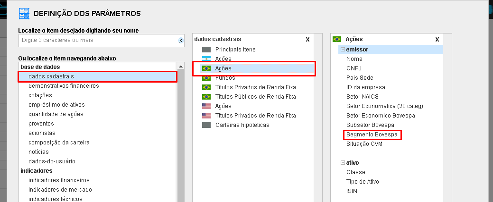
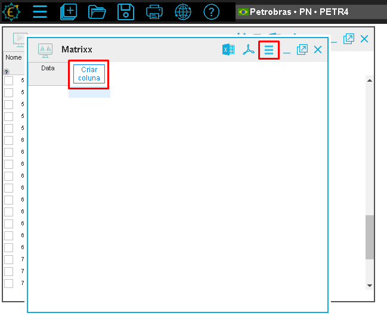
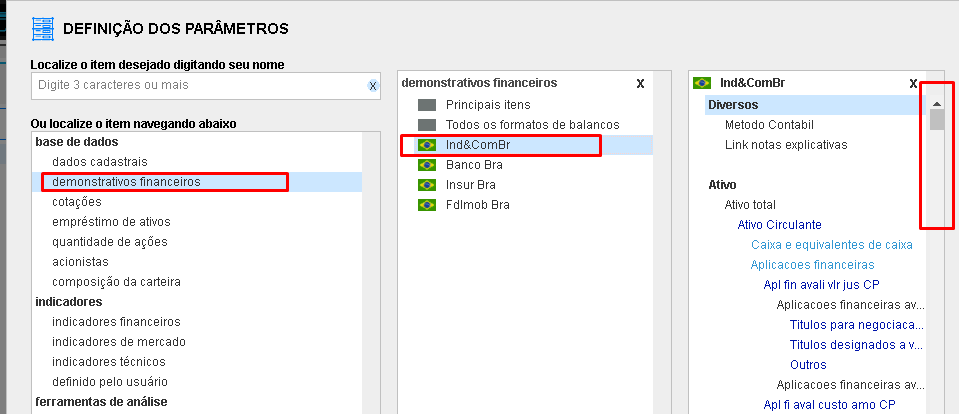
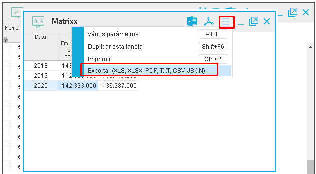
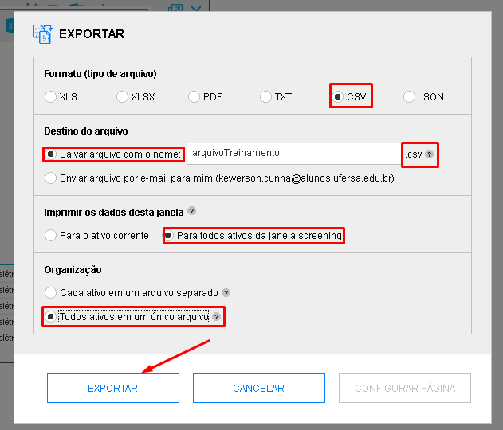
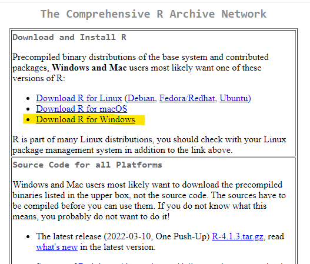
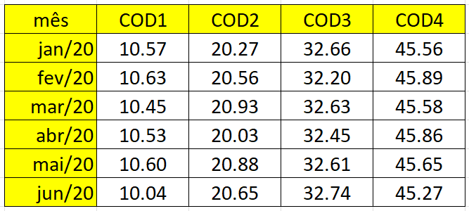

\newpage

```{r setup, include=FALSE}
knitr::opts_chunk$set(echo = TRUE, cache = FALSE, prompt = FALSE,
                      tidy = FALSE, comment = NA, message = FALSE,
                      warning = FALSE, fig.width=2, fig.height=4)
```

# PROJETO CONTABILIDADOS

Esse projeto se justifica pela oportunidade de sumarizar os dados públicos de entidades públicas e privadas para a sociedade em geral, levando informação de qualidade para acompanhamento da gestão. O simples fato de divulgar não torna as informações disponíveis relevantes para a sociedade. A partir do momento que se aproveita os preceitos de governança corporativa estimuladas pela Comissão de Valores Mobiliários (CVM), e as determinações legais advindas da Lei Complementar nº 101 (2000), popularmente conhecida como Lei de Responsabilidade Fiscal (LRF), da Lei Complementar nº 131 (2009) que alterou a LRF no que concerne a transparência, combinadas com a Lei nº 12.527 (2011) -- Lei de Acesso à Informação (LAI), que versa sobre o direito do cidadão ao acesso à informação, é possível tornar os dados dispersos em informações úteis aos cidadãos interessados nas finanças do Brasil.

Esse projeto, consiste, portanto, em acompanhar o desempenho e atividades de entidades públicas e privadas, por meio de consolidação de dados divulgados de forma dispersa, trazendo para a sociedade indicadores sumarizados sobre a gestão pública e corporativa no Brasil. Ao mesmo tempo cuida em manter bancos de dados disponíveis para futuras pesquisas de interesse público e privado com divulgação de índices de sentimento e indicadores.

## OBJETIVOS

-   Mapear bases de dados disponíveis na web;
-   Organizar a base central de dados orçamentários, financeiros, contábeis e de gestão de entidades públicas e privadas;
-   Criar rotina para tratamento dos dados;
-   Disponibilizar dados à comunidade;
-   Treinar docentes, discentes e membros da sociedade em geral com interesse em fazer uso da ciência de dados para avaliar a gestão pública e privada no Brasil.

## METODOLOGIA

Após mapear as fontes de dados disponíveis e confiáveis, serão direcionados os tipos de dados a serem explorados (financeiros, fiscais, previdenciários, gestão, dentre outros). Com base na definição dos dados a serem explorados será definida a política do observatório, iniciando com a criação de rotinas de extração, tratamento e divulgação dos dados.

Com a compreensão das rotinas e dados a serem explorados, serão definidas as equipes para estruturação das bases de dados, tendo como objetivo inicial a sumarização e "clusterização" dos dados. Para fins de benchmark de coleta estão repositórios públicos como por exemplo, na Secretaria do Tesouro Nacional, IBGE, Federação das Indústrias do Rio de Janeiro (FIRJAN), Fundo Nacional de Educação, Fundo Nacional da Saúde, RAIS, CAGED, Comissão de Valores Mobiliários (CVM), Brasil Bolsa Balcão (B3), entre outras.

A etapa seguinte consiste em calcular indicadores e/ou índices de gestão, contábil ou de sentimento, de forma a produzir informações individualizadas de entidades públicas e privadas, definindo o formato de divulgação dos dados (sumarizados ou microdados). Para essa etapa serão utilizados diversos softwares, tais como: R, Stata, Matlab, Power BI, Python e Excel. Nessa etapa se iniciam os treinamentos de alunos e professores para condução dos subprojetos, divididos por área de interesse a ser definida após tratamento dos dados. Ao final serão construídos os dicionários das bases de dados criadas e definidos os painéis para consulta de dados (dashboards) com o respectivo treinamento de alunos, professores e sociedade em geral.

**Mais informações** sobre o Projeto contabiliDados [**clique aqui**](dgp.cnpq.br/dgp/espelhogrupo/5876410881852665)

\newpage

# SOBRE ESTE TREINAMENTO

## EMENTA

Apresentação da plataforma Economatica. Utilização das ferramentas screener e matrix. Geração de bancos de dados em excel em séries temporais e dados em painel. Apresentação da plataforma R e R Studio. Operações básicas no R. Tipos de objeto. Importação de planilhas e dados externos. Geração de banco de dados. Estatística descrita com valores e gráficos.

## OBJETIVOS

-   Estimular os alunos a utilizar ferramentas de análise de dados em atividades relacionadas à área contábil;
-   Capacitar os alunos na ferramenta R Programming;
-   Abordar, na prática, conceitos de contabilidade, estatística e análise de dados.

## METODOLOGIA

Serão utilizados dados da plataforma Economatica para geração de indicadores contábeis básicos com o intuito de demonstrar usos básicos da plataforma R Programming. Os dados gerados serão importados, tratados e analisados, propiciando a interação entre os alunos e as ferramentas estudadas.

## MATERIAL COMPLEMENTAR

A apresentação desse treinamento pode ser acessada pelo canal do youtube do 
Projeto UFERSA3 - Liga de Mercado Financeiro da UFERSA:

Parte 1: [clique aqui](https://youtu.be/7mgmchEo-1w)

Parte 2: [clique aqui](https://youtu.be/Bckx1xIqGto)

>>> O canal do youtube também dispõe de vídeos com exploração de ferramentas básicas
e avançadas do Economatica.

>>> Acesse: [www.youtube.com/c/ProjetoUfersa3](www.youtube.com/c/ProjetoUfersa3)


\newpage

# EQUIPE RESPONSÁVEL

Prof. **Kléber Formiga** Miranda

&nbsp; [**E-mail** - mirandakf\@ufersa.edu.br](mailto:mirandakf@ufersa.edu.br) |
[**Lattes** - lattes.cnpq.br/5969359253746807](http://lattes.cnpq.br/%205969359253746807)

&nbsp; [**Github** - github.com/kleberformiga](https://github.com/kleberformiga) |
[**Linkedin** - br.linkedin.com/in/kleberformiga](https://br.linkedin.com/%20in/kleberformiga)

&nbsp;

Prof. **Lucas** Lúcio **Godeiro**

&nbsp; [**E-mail** - lucasgodeiro\@ufersa.edu.br](mailto:lucasgodeiro@ufersa.edu.br) |
[**Lattes** - lattes.cnpq.br/0903970970268664](http://lattes.cnpq.br/0903970970268664)

&nbsp; [**Github** - github.com/lucasgodeiro](https://github.com/lucasgodeiro) |
[**Linkedin** - br.linkedin.com/in/lucas-godeiro](https://www.linkedin.com/in/lucas-godeiro-a1b42567)

&nbsp;

Prof. **Alexsandro** Gonçalves da Silva **Prado**

&nbsp; [**E-mail** - alexsandro.prado\@ufersa.edu.br](mailto:alexsandro.prado@ufersa.edu.br) |
[**Lattes** - lattes.cnpq.br/4254857944224293](http://lattes.cnpq.br/4254857944224293)

&nbsp; [**Github** - github.com/alexsandroprado](https://github.com/alexsandroprado) |
[**Linkedin** - br.linkedin.com/in/alexsandroprado](https://www.linkedin.com/in/alexsandroprado)

&nbsp;

**Kewerson** Alves **Cunha**

&nbsp; [**E-mail** - kewerson.cunha\@alunos.ufersa.edu.br](mailto:kewerson.cunha@alunos.ufersa.edu.br) |
[**Lattes** - lattes.cnpq.br/3158464950144943](http://lattes.cnpq.br/3158464950144943)

&nbsp; [**Github** - github.com/nosrewek](https://github.com/nosrewek) |
[**Linkedin** - br.linkedin.com/in/kewerson-alves-cunha](https://www.linkedin.com/in/kewerson-alves-cunha-15052000)


&nbsp;

**Tomaz** da Silva **Melo**

&nbsp; [**E-mail** - tomaz.melo\@alunos.ufersa.edu.br](mailto:tomaz.melo@alunos.ufersa.edu.br) |
[**Lattes** - lattes.cnpq.br/5153159638802664](http://lattes.cnpq.br/5153159638802664)

&nbsp; [**Github** - github.com/TomazMelo](https://github.com/TomazMelo) |
[**Linkedin** - br.linkedin.com/in/tomaz-melo](https://br.linkedin.com/in/tomaz-melo-680999222)

&nbsp;

**Isabele** Vieira de **Matos**

&nbsp; [**E-mail** - isabele.matos\@alunos.ufersa.edu.br](Isabele.matos@alunos.ufersa.edu.br) |
[**Lattes** - lattes.cnpq.br/3188106686594869](http://lattes.cnpq.br/3188106686594869)

&nbsp; [**Linkedin** - br.linkedin.com/in/isabele-matos](https://www.linkedin.com/in/isabele-matos-b13602196)

\newpage


# ECONOMATICA

A Economatica é constantemente alimentada com os dados mais recentes do mercado
financeiro e permite ao usuário manipular um grande volume de dados, encontrá-los
facilmente e capturá-los sem estresse para fazer simulações avançadas e comparar
ativos com maior facilidade e eficiência. Tudo isso, para oferecer uma visão mais
ampla e melhor subsídio para produzir melhores análises, realizar melhores 
relatórios e obter melhores insights, enquanto economiza tempo de suas equipes.
(Fonte: [Site Economatica, 2022](https://economatica.com/plataforma-financeira)).

Neste treinamento, vamos mostrar como acessar o economatica para realizar uma
tarefa simples: coletar o Ativo Circulante (AC) e o Passivo Circulante (PC) de
empresas do setor elétrico para cálculo da liquidez corrente (AC/PC). A proposta
é demonstrar o passo a passo para coletar dados contábeis na plataforma
Economatica, gerando um banco de dados em excel com arquivo no formato CSV, em
formato de painel.

O formato painel é comumente usado em pesquisas da área contábil. Essencialmente,
dispor os dados em painel significa que teremos uma variável (coluna) com o 
código da empresa (*id* ou individuo), outra com o tempo (*t*) e as demais
variáveis de interesse. No caso desse treinamento, o ativo circulante e o passivo
circulante. Os dados ficarão assim:

|  cod  | ano  | ativoCirc | passivoCirc |
|:-----:|:----:|:---------:|:-----------:|
| ABCD3 | 2018 |  123.415  |   100.280   |
| ABCD3 | 2019 |  100.420  |   104.718   |
| ABCD3 | 2020 |  101.213  |   99.530    |
| XYKW3 | 2018 |  52.400   |   40.313    |
| XYKW3 | 2019 |  77.681   |   76.990    |
| XYKW3 | 2020 |  43.520   |   49.333    |

Observe que as empresas ABCD3 e XYKW3 aparecem empilhadas na coluna *cod* e 
possuem os anos de 2018 a 2020 na coluna *ano*, seguidos dos valores das
variáveis de interesse: Ativo Circulante (ativoCirc) e Passivo Circulante
(passivoCirc). Essa disposição de dados em uma tabela é denominada "Dados em
Painel". Embora existam outras disposições para esses dados, escolhemos esse
formato por ser mais usual.

## Coletando os dados

**Passo 1:** Acessar a plataforma Economatica


```{r echo=FALSE, out.width='80%', fig.align='center'}
knitr::include_graphics('images/eco_login.png')
```

Conforme pode ser visto na figura acima, após o usuário acessar o site
[*www.economatica.com*](www.economatica.com), clica em *Login* para que apareça
uma tela com o *email* e o *botão* para realizar o login. O *email* informado
deverá ser o do usuário para controle de acesso. O acesso é livre dentro das
dependências da UFERSA. Pelo contrato vigente, qualquer máquina dentro do IP da 
UFERSA terá acesso ao economatica (limite de 50 acessos simultâneos).

**Passo 2:** Tela Inicial

```{r echo=FALSE, out.width='80%', fig.align='center'}
knitr::include_graphics('images/eco_inicio.png')
```

Após login, aparecerá a tela inicial. Neste treinamento, vamos nos concentrar em 
duas opções: Screening e Matrix (ver destaque). Vamos iniciar pelo Screening.

**Passo 3:** Screening - Escolha da Tela Pré-Formatada

```{r echo=FALSE, out.width='80%', fig.align='center'}

```

O Economatica dispõe de várias de várias telas pré-formatadas. Vamos usar o
screening pré-formatado "Básico". Nesse screening serão selecionadas as empresas
que *negociam ações na B3* (Brasil, Bolsa, Balcão) e que *estejam ativas*. Basta
escolher a aba "Ações" e clicar no botão "ABRIR", conforme figura acima.


**Passo 4:** Screening - Escolha de dados

```{r echo=FALSE, out.width='70%', fig.align='center'}
knitr::include_graphics('images/eco_screenerEscolheDado.png')
```

Após aberto o screening, clica na opção "Criar Coluna" para que apareça a
janela com várias opções. Vamos usar a opção "Dados Cadastrais".

**Passo 5:** Screening - Seleciona Segmento

```{r echo=FALSE, out.width='90%', fig.align='center'}

```


Clica em "Dados Cadastrais" -> "Ações -> "Segmento Bovespa".

Com essa sequência, será incluída uma coluna "Segmento Bovespa" na qual constarão
o segmento de cada empresa selecionada no screening básico, conforme figura a
seguir.

**Passo 6:** Screening - Filtra Segmento

```{r echo=FALSE, out.width='70%', fig.align='center'}
knitr::include_graphics('images/eco_inserirFiltro.png')
```

Como a proposta é estudar empresas do setor elétrico, vamos filtrar apenas
empresas do segmento "Energia Elétrica". Para isso, basta clicar com o botão
direito do mouse no título da coluna "Segmento Bovespa" e escolher a opção do
menu "Inserir filtro baseado nesta coluna". Aparecerá a seguinte tela:

```{r echo=FALSE, out.width='90%', fig.align='center'}
knitr::include_graphics('images/eco_aplicaFiltro.png')
```

O primeiro procedimento nesta tela é clicar na opção "Mostrar apenas uma 
classe por empresa (a de maior volume no último mês)". Esta opção faz com que
seja apresentada apenas um código por empresa (o de maior de negociação no mês
anterior). Como estamos coletando dados contábeis, essa opção faz sentido, já
que o ativo circulante da PETR3 é o mesmo que o da PETR4 em cada ano. Essa opção
não faz sentido quando coletarmos dados referente a negociações, como preço e 
volume, pois cada papel (PETR3 e PETR4, por exemplo) tem valores diferentes,
diariamente. Assim, selecionaremos essa opção (basta clicar).

O segundo procedimento é abrir a listBox do filtro da coluna "Segmento Bovespa".
Após clicar no listBox, aparecerá a janela da figura acima. Selecionaremos o
segmento "Energia Elétrica".

Após clicar "OK", o screening terá apenas um código por empresas e apenas as
empresas do segmento "Energia Elétrica", conforme figura abaixo:

```{r echo=FALSE, out.width='50%', fig.align='center'}

```

É possível observar a lista de empresas apenas do segmento selecionado e apenas
uma classe por empresa. Temos, portanto, a lista de empresas definidas para
este treinamento: empresas do setor elétrico.

**Passo 7:** Matrix - Estrutura

Sem fechar o screening, escolha outro serviço clicando no botão com sinal de "+"
indicado na figura abaixo:

```{r echo=FALSE, out.width='70%', fig.align='center'}
knitr::include_graphics('images/eco_mudaOpcao.png')
```

Voltaremos para a tela mostrada no *Passo 2*. Selecione Matrix. Deverá aparecer uma tela, conforme abaixo:

```{r echo=FALSE, out.width='60%', fig.align='center'}

```

Essa é a estrutura de um matrix vazio. É possível observar que já há a coluna 
"Data" e a opção de "Criar coluna". Na coluna "Data", teremos a série de tempo
na frequência que escolhermos (diária, mensal, trimestral, anual). Essa escolha
é feita clicando no botão com três traços (em destaque). Esse é o primeiro
procedimento dessa etapa. Clique no botão com três traços para aparecer a tela
abaixo:

```{r echo=FALSE, out.width='50%', fig.align='center'}

```

Podemos escolher, dentre outras opções, o período inicial e final da série e a
frequência. Neste exemplo, escolhemos como inicio 01/01/2018 e fim 31/12/2020.
A frequência escolhida foi em "Anos" (anual). Clica em "OK". Após essa
configuração, a coluna "Data" do matrix passará a ter a frequência anual, no
período estabelecido.


**Passo 8:** Matrix - Configuração da conta

Após configurada a coluna "Data", vamos configurar a coluna da conta. Clique em
"Criar Coluna" para aparecer a tela abaixo:

```{r echo=FALSE, out.width='90%', fig.align='center'}

```

A configuração consiste em escolher a conta desejada. Na figura acima estamos
selecionando a conta "Ativo Circulante", conforme essa sequência:

clique em "demonstrativos financeiros" -> IndComBR -> Ativo Circulante

Após clicar em "Ativo Circulante", aparecerá a tela abaixo:

```{r echo=FALSE, out.width='90%', fig.align='center'}
knitr::include_graphics('images/eco_configuraContaSelecionada.png')
```

Deixe a opção "corrente" selecionada. Isso servirá para gerarmos o banco de dados
pretendido. Clique em "OK" e o resultado final será:

```{r echo=FALSE, out.width='70%', fig.align='center'}
knitr::include_graphics('images/eco_matrixFinal.png')
```

Observamos a coluna "Data" com o período de 2018 a 2020, conforme configuração.
Na tela acima, além do Ativo Circulante (AtvCir) também vemos a conta (coluna)
com Passivo Circulante (PasCir). Para inclusão do Passivo Circulante, repita os
mesmos procedimentos utilizados para selecionar o Ativo Circulante (Passo 8). 
Como deixamos a opção "corrente" marcada, passaremos para a exportação dos dados 
para o excel.

**Passo 9:** Exportação

Na tela do Matrix, clique no botão com três traços (destaque) e clique na opção
"Exportar (XLS, XLSX, PDF, TXT, CSV, JSON)".

```{r echo=FALSE, out.width='70%', fig.align='center'}

```

Após clicar, aparecerá a seguinte tela:

```{r echo=FALSE, out.width='70%', fig.align='center'}

```

Neste exemplo, vamos gerar um arquivo com extensão "CSV". Seguindo a sequência
da tela acima:

1. Selecione o formato "csv"
2. Defina um nome para o arquivo (veja que já tem a extensão na frente do campo).
Será salvo um arquivo com nome "arquivoTreinamento.csv".
3. Selecione a opção "Para todos os ativos da janela screening (não fechamos o
screening para que essa opção fosse usada, coletando os dados de todas as
empresas do setor elétrico, conforme nossa configuração do screening)
4. Selecione "Todos ativos em um único arquivo" para que fique tudo em um só
arquivo csv (todo o banco de dados em um só arquivo).


**Passo 10:** Visualiza o banco de dados no excel

Verifique em qual pasta do seu computador o Economatica salvou o arquivo com o
nome indicado (nosso exemplo foi "arquivoTreinamento.csv") e o abra. O resultado
é apresentado na figura abaixo:

```{r echo=FALSE, out.width='50%', fig.align='center'}
knitr::include_graphics('images/eco_verExcel.png')
```

É um arquivo cujas colunas são separadas por vírgulas. Então temos a coluna
"Ativo" com os códigos das empresas (o texto <XBSP> vem na configuração do
Economatica - será tratado no R), "Data" com os anos e mais duas colunas com
Ativo Circulante e Passivo Circulante. Salve esse arquivo em uma pasta de fácil
identificação, pois finalizamos o processo de geração do banco de dados no
Economatica e vamos importá-lo, tratá-lo e analisá-lo no R.

Agora vamos fazer uma breve exposição sobre o R e retornaremos com o uso dessa
base de dados gerada.

\newpage

# R PROGRAMMING
## Contexto
A linguagem R surgiu da necessidade de pesquisadores de estatística tratarem e
manipularem dados. Em nossas pesquisas científicas utilizamos o R com bastante
frequência. Embora não seja uma das linguagens mais usadas
(ver ranking em [http://www.benfrederickson.com/ranking-programming-languages-by-github-users/](http://www.benfrederickson.com/ranking-programming-languages-by-github-users/)),
encorajamos o uso do R por atender nossas demandas de pesquisa (até mesmo 
profissionais) nos permitindo adicionar novas funcionalidades por meio da
definição de funções (o excel também permite, via VBA!).

O R possui um ambiente de desenvolvimento chamado *R Studio*. Com o *R Studio*
temos uma melhor experiência de usuário. Podemos acessar arquivos do computador
(como o windows explorer), visualizar gráficos, controlar projetos, acesso a
tutoriais, interagir com outras linguagens, gerar relatórios em HTML, PDF e ePUB,
dentre outras funcionalidades. Para fins didáticos, pense: é melhor
usar o windows por meio de seu prompt de comando ou por meio de sua interface
gráfica?

A resposta dificilmente será por meio de seu prompt de comando. Ao instalar o R,
inicialmente não temos o ambiente de desenvolvimento ou IDE. Assim, instalamos, 
primeiramente, a interface gráfica para, somente depois, instalar sua IDE.
Para saber mais sobre o R acesse ([www.r-project.org](https://www.r-project.org)).
Com a IDE teremos disponíveis várias funcionalidades e facilidades como
sugestão de funções após digitar 3 letras e indicações de erro. Parece simples,
mas ajuda muito!

## Instalando o R e o R Studio

**Passo 1** Instalando o R

Poderíamos colocar um link direto, mas é importante saber que o R é compartilhado
em vários países e possui vários servidores espelhados (possuem a mesma informação)
para que o usuário possa escolher de onde quer baixar o R. Para ver onde escolher
acesse [cran.r-project.org/mirrors.html](https://cran.r-project.org/mirrors.html).

Clicamos no espelho (mirror) da UFPR, no Brasil:

```{r echo=FALSE, out.width='70%', fig.align='center'}
knitr::include_graphics('images/mirrors.png')
```

Após clicar, aparecerá a opção de download:

```{r echo=FALSE, out.width='50%', fig.align='center'}

```

Selecionamos, para este exemplo, o download para windows. Mas também é possível
instalar o R para Linux e macOS. Deve aparecer a seguinte tela:

```{r echo=FALSE, out.width='60%', fig.align='center'}

```

Clique em Instalar R pela primeira vez ("install R for the first time") e
aparecerá a seguinte tela:

```{r echo=FALSE, out.width='60%', fig.align='center'}
knitr::include_graphics('images/downloadR2.png')
```

Esta tela mostra a versão atual do sistema (4.1.3, nesse exemplo). Clique em
"Download R 4.1.3 for Windows". Durante a instalação será perguntado se instala
em 32bits (executável i386) ou 64bits (executável x64). A maioria das máquinas é
de 64bits nos dias atuais. Caso tenha dúvidas, pergunte a algum profissional que
possa ajudá-lo nessa demanda.

Será baixado um arquivo para instalação. Execute a instalação. O R estará
instalado em sua máquina. Caso queira usar a interface do R, basta buscar
o executável do x64. Contudo, sugerimos usar a IDE - o R Studio. Para instalar,
vamos para o Passo 2.

**Passo 2** Instalando o R Studio

Acesse o site de download do R Studio
[www.rstudio.com/products/rstudio/download/](https://www.rstudio.com/products/rstudio/download/). Nesse site, procute a opção destacada na figura abaixo:

```{r echo=FALSE, out.width='60%', fig.align='center'}
knitr::include_graphics('images/downloadRStudio.png')
```

Clicamos no botão "Download" e será apresentada a seguinte tela:

```{r echo=FALSE, out.width='50%', fig.align='center'}
knitr::include_graphics('images/botaoDownloadRStudio.png')
```

Será baixado o executável. Instala tudo sem alterar configurações.

Agora é só usar o R Studio!!!


## Conhecendo o R Studio

Ao abrir o R Studio, o usuário iniciante deverá observar que existem 4 frames
(partes) que dividem o R Studio. Elas podem ser customizadas, então cada
usuário pode modificar ao seu estilo. Neste treinamento, será demonstrada a
tela, conforme configuração do usuário que preparou o material. Contudo, todos
os menus e itens são os mesmos. A única que muda é a disposição na tela. Vejamos
uma tela inteira:

```{r echo=FALSE, out.width='80%', fig.align='center'}

```

Destacamos os pontos que apresentaremos neste treinamento, mesmo que usando
somente alguns deles. Há um menu destacado na parte superior, um botão (list)
no canto superior direito com o nome "Project (none)", referente a projetos e,
quatro frames com pontos destacados. O menu superior será percorrido durante o
treinamento e suas várias possibilidades não serão abordadas nesse treinamento. 
O botão de projetos também não será utilizado, mas trata-se da possibilidade de
trabalharmos com vários projetos, utilizando controle de versões de cada um.

Observe que no canto superior direito de todos os frames tem dois botões que
servem para minimizar o maximizar a janela. Caso algum frame tenha sumido de
seu computador, tenha calma! Pode apenas ter sido minimizado. Basta maximizar ou
restaurar o tamanho do frame!

Os quatro frames serão apresentados a seguir, individualmente:

### **Frame 1** Script

```{r echo=FALSE, out.width='60%', fig.align='center'}

```

Ao abrir o R studio esse frame pode não está aberto. Para tal, clica-se no
menu *File -> New File -> R Script*. Esse espaço corresponde a um bloco de notas
para que possamos colocar todos os nossos códigos. O interpretador da linguagem
R executará todos os comandos apresentados. Os resultados dos comandos serão7
apresentados nos demais frames.

Algumas particularidades:

* Se colocarmos um hashtag (#) no início de um comando o interpretador entenderá
como um comentário. Não executará! Os comentários são importantes para que outros
usuários possam dar sequência ao trabalho iniciado - Especialmente quando se
trabalha com conjunto.
* Se fizermos alguma operação matemática, o interpretador calculará e mostrará
o resultado no console (próximo frame que apresentaremos).
* Se colocarmos um nome (sem espaços ou acentos e não iniciando com números),
seguidos do símbolo igual (=) ou (<-) e depois escrevermos um código válido,
o R guardará essa informação para uso posterior.

Vejamos um exemplo (Copiem o código no Script, selecionem o comando desejado ou
todo o código e, em seguida, clique nas teclas Ctrl+Enter do seu teclado):

```{r, echo=TRUE}

# Aqui fica um comentário. Exemplo: calculando quanto é 2+2

2+2

# Agora vou atribuir o resultado a um objeto chamado total

total <- 2+2

# ou

total = 2+2

# O total não aparecerá no console, mas aparecerá na aba "Environment". Lembremos
# que o R guarda essa informação quando usamos "=" ou "<-" após um termo seguido
# de um código válido

```

### **Frame 2** Console

```{r echo=FALSE, out.width='60%', fig.align='center'}

```

Primeiro destacamos uma curiosidade: cada versão do R possui um nome associado
a uma tirinha do Charlie Brown (coisa dos criadores nerds da plataforma - nós
gostamos disso... rsrs). Uma lista das versões com as tirinhas foram compiladas
no site [livefreeordichotomize.com/2017/09/28/r-release-names/](https://livefreeordichotomize.com/2017/09/28/r-release-names/) que não estava atualizada quando preparamos
este material. Encontramos a tirinha referente ao "Kick Things" no Twitter
[twitter.com/WomenInStat/status/1449462277581721601?s=20&t=tWTsKDsW4g23NAuD5Fsd1g](https://twitter.com/WomenInStat/status/1449462277581721601?s=20&t=tWTsKDsW4g23NAuD5Fsd1g).
Veja abaixo:

```{r echo=FALSE, out.width='100%', fig.align='center'}

```

E ai... você está mais pra Lucy ou para Charlie Brown? No projeto contabiliDados
temos as duas personalidades. Voltando...

Destacamos, também, o sinal ">" . É o local onde sairão os resultados dos comandos
que colocamos no script. Façam o teste e vejam:

```{r echo=FALSE, out.width='50%', fig.align='center'}

```

Esse resultado aparecerá no seu console após selecionar o comando "2+2" e aperta
Ctrl+Enter. Os comandos podem ser feitos direto no console também, porém não ficam
registrados para um uso posterior. Na grande maioria das vezes registramos tudo
no Script. Vai que precise depois!! Vamos ao próximo frame.

### **Frame 3** Local para registro

```{r echo=FALSE, out.width='60%', fig.align='center'}
knitr::include_graphics('images/telaRStudioframe3.png')
```

Temos quatro abas em destaque um botão destacado com R/Python para demonstrar
que o R Studio também suporta a linguagem python (também suporta java, bash...).
Então um código poderia ser usado com R e Python ao mesmo tempo. Nunca precisamos
usar essa funcionalidade (ainda!). Agora vamos aos itens das abas:

* **Environment** onde ficarão registrados todos os objetos criados no script
(ou no console, se fizer diretamente por lá). Os objetos são criados ao se
atribuir um nome, colocar "=" ou "<-" e, em seguida, colocar um comando válido.
Ao criar um objeto, seu resultado não aparece no console, mas sim no Environment.

* **History** onde ficam registrados todos os comandos executados.

* **Connections** usado para fazer conexões de bancos de dados (SQL, por exemplo).

* **Tutorial** contém diversos tutoriais para uso do R ou R Studio. Muito útil!
Está em inglês (nada como o google tradutor, mas vamos praticar o inglês também!).

A medida que formos usando o R Studio aprenderemos mais sobre esses itens.

### **Frame 4** Utilitários

```{r echo=FALSE, out.width='70%', fig.align='center'}

```

Destacamos cinco abas e um caminho. O caminho é o local do computador onde essa
imagem foi feita (D: -> repos -> projects -> contabilidados). Recomendamos que
estabeleçam um diretório específico para cada projeto. Esse arquivo PDF com este
curso foi gerado com código R que está dentro da pasta tutoriais, por exemplo.
Seguem alguns comentários sobre cada aba.

* **Files** simula o windows explorer para identificação e localização das pastas
no computador. Ao invés de localizar arquivos para renomear ou usar sua localização
no windows explorer, poderemos usar essa aba (é como fazemos no projeto
contabiliDados).

* **Plots** é o local onde aparecerão os gráficos criados pelos scripts.

* **Packages** ainda não falamos deles, mas são as funções programadas para as
mais diversas atividades. Nessa aba é possível ver todas as funções (chamamos de
pacotes) instaladas. Também usamos essa aba para atualizar os pacotes existentes
ou instalar novos pacotes. O R já possui vários pacotes por padrão (chamamos de
funções base). Neste treinamento usaremos apenas os pacotes base do R, portanto,
não precisaremos instalar ou requerer qualquer pacote.

* **Help** quem não precisa de um help? É nessa aba que podemos fazer buscas
sobre ajudas nos pacotes. Na realidade, recomendamos que sejam observadas as
documentações de cada pacote que usem.

* **Viewer** Nesse local são apresentadas tabelas e gráficos em formato HTML.


## Linguarem R no R Studio

A partir de agora, os comandos destacados na parte cinza do PDF poderão ser
copiados para o script. Fazendo isso, ao invés de digitar todo o código,
diminuiremos a chance de erro, além de fazermos uma replicação fiel do
treinamento.

### Operações aritméticas

Digitem o código abaixo e executem (Ctrl+Enter). Observem que os resultados
aparecem no console.

```{r}

# Adicão
1 + 3
# Subtração
3 - 1
# Multiplicação
4 * 2
# Divisão
4 / 2
# Resto da Divisão (Módulo)
5 %% 2

```

Para fins de exemplo, vamos utilizar um desses casos por meio de objetos
(observem o uso de comentários na frente de cada código - é útil):

```{r}

# criaremos o objeto "pizzas" para indicar a quantidade de pizzas e o objeto
# "criancas" para indicar a quantidade de crianças.
# Depois de criados, esses objetos aparecem na aba Environment (confira!)

pizzas <- 2 # usamos <- para criar o objeto
criancas = 7 # usamos = para criar o objeto

# No pedido as pizzas vieram com 8 fatias cada, então vamos criar o objeto
# fatias

fatias <- pizzas * 8 # Usamos a multiplicação

# vamos ver quantas fatias temos para as 7 crianças

fatias

# A regra da casa é que cada criança coma duas fatias. E todas farão isso!
# Vamos criar o objeto "qdeFatiasporCrianca"

qdeFatiasporCrianca <- fatias / criancas # usamos divisão

# Vamos ver o resultado de quantas fatias por criança temos
qdeFatiasporCrianca

# Vimos que deu 2,28 fatias por criança. Então, se cada uma come 2 fatias,
# quantas fatias sobram?

fatias%%criancas # usamos o módulo

```

**Descobrimos que vão sobrar 2 fatias!**

Assim seria um código comentado. Se a pessoa responsável pela casa perguntasse 
como foi feita a divisão por criança, teríamos todos os passos registrados. Isso
facilita a auditoria dos processos e permite replicar o código a cada vez que
precisar dividir pizzas. Bastaria trocar os valores dos objetos "criancas" e
"pizzas".

O exemplo é simples, mas passa a noção do que podemos fazer com casos mais 
complexos. Outro aspecto importante é saber o tipo de cada variável que estamos
trabalhando.

### Tipos de dados


* **Numéricos** usamos para fazer operações matemáticas usando, inclusive, 
decimais. Será identificado no R como do tipo "**numeric**".

* **Inteiros** são usados para os casos de número que não tenham decimais (idade,
por exemplo), mas que precisamos fazer operações matemáticas. Imagine a pergunta
QUAL A IDADE MÉDIA DOS ALUNOS DA SALA? Seria tratada no R como valores inteiros,
mas seu resultado poderia ser um dado do tipo "numeric", já que a idade média
poderia resultar em 4,5 anos. Os inteiros serão identificados no R como do tipo
"**integer**". Importante frisar que, por padrão, qualquer número será considerado
do tipo "numeric" pelo R. O usuário precisará indicar que o dado é do tipo
inteiro.

* **Booleanos** são dados lógicos que adotam valores verdadeiros (1) ou falsos (0).
Assumem valores como TRUE ou FALSE. Também podem ser representados pelas letras
T (TRUE) ou F (FALSE). É tratado no R como dado do tipo "logical".

Internamente os valores são 0 ou 1, então se somarmos
TRUE + FALSE, teremos 1? Vamos ver:

```{r}
TRUE + FALSE # Vimos que dá igual a 1

TRUE * FALSE # Vimos que dá igual a 0

```

Esse conceito é importante para compreender!!! É muito demandado quando queremos
filtrar os dados, por exemplo.

* **Strings** são valores de texto, pois podemos trabalhar com unidade da
federação (RN, CE, GO...) que são dados com texto. Assim, os dados que possuem
texto ou são indicados serem do tipo texto são strings, identificadas no R como
"character".

Para identificar qual o tipo do dado usamos uma função chamada "class".


```{R}

# Numérico

v_numerico <- 19
class(v_numerico)

# Inteiro

# Usamos a função as.integer para indicar para o R que o dado é do tipo inteiro
v_inteiro <- as.integer(v_numerico)
class(v_inteiro)


# Booleano

v_booleano <- TRUE
class(v_booleano)

# String

v_string <- "Contabilidados"
class(v_string)


```


Até agora descobrimos:

1. Como gerar um arquivo disposto em painel por meio da plataforma Economatica;
2. Como é o layout da plataforma R Studio;
3. Como fazer operações matemáticas com linguagem R;
4. Que Ctrl+Enter executa meu código selecionado;
5. Como atribuir valores a objetos (= ou <-);
6. Como verificar o tipo de variável (class);
7. sem mencionar diretamente, que as funções recebem um nome e depois temos um 
parênteses para inserir os valores ou parâmetros. Usamos a função class e 
as.integer até agora.

Agora, vamos aprender a usar a função "c()". É uma função base do R que combina
valores. Os valores combinados são chamados de vetor. Então podemos ter um vetor
de nomes ou vetor de notas. Cada vetor assume um tipo de variável.

Então se temos em uma sala 3 alunos: Maria, José e Pedro e sabemos que suas notas
em matemática foram, respectivamente, 8, 9 e 10, poderíamos querer trabalhar
esses dados para alguma decisão. Vamos usar a função "c()".

De forma ineficiente, poderíamos calcular a média dos três alunos assim:

```{r}

(8 + 9 + 10) / 3 # ou

maria <- 8
jose <- 9
pedro <- 10

(maria + jose + pedro) / 3

```

Usando a função c() faremos assim:

```{r}
notasTurma <- c(8, 9, 10)

class(notasTurma) # o vetor é do tipo "numeric"

```


Para saber a soma das notas da turma usaremos a função "sum()"

```{r}
sum(notasTurma) # Deu igual a 27
```

Agora se dividirmos o resultado desse comando por 3, teremos a média. Então:

```{r}
sum(notasTurma) / 3 # Opa... deu 9 mesmo!
```

Porém, precisaríamos informar a quantidade de itens quando a quantidade de notas
fosse diferente de 3. Isso é ruim... Então usaremos a função "mean()" para
calcular a média das notas.

```{r}
mean(notasTurma) # Muito mais prático
```


Agora que sabemos criar um novo objeto e entender o que faz a função c(),
podemos expor outro tipo de variável: O fator.

* **Fator** são dados relacionados a categorias. Facilita a sumarização de dados
e é identificada no R como do tipo "factor". Exemplo:

```{r}

sexo <- c(0, 1, 1, 1, 0) # 0 Masculino, 1 Feminino

factor(sexo) # Identificamos dois níveis (levels): 0 e 1

```

Se quisermos dar nomes para os níveis (chamamos os nomes de labels), criaremos o
objeto "fsexo" como fator, indicado os labels na função "factor()". Observe que
a função "factor()" possui alguns parâmetros: x (vetor), levels e labels). Cada
função tem seus parâmetros específicos.

```{r}

fsexo <- factor(x = sexo, levels = c(0,1), labels = c("Masculino", "Feminino"))
class(fsexo)

```

Com o objeto "fsexo" sendo do tipo fator, usaremos uma nova função: a "summary()".

```{r}
summary(fsexo)
```

A função contou a quantidade de observações estão em cada categoria (level) do
fator. Esse conceito é muito utilizado!


## Trabalhando com conjuntos de dados

No mundo real, coletamos dados para formar bancos de dados (dados primários) ou
coletamos dados diretamente de fonte de terceiros (dados secundários). No projeto
contabiliDados, normalmente utilizamos dados secundários, tendo como fonte o banco
mundial, CVM, sites diversos (web scraping), dentre vários outros. Algumas
pesquisas também são desenvolvidas com aplicação de questionários ou entrevistas
que geram bancos de dados primários. O importante é saber que trabalhamos mais com
conjuntos de dados do que com dados individuais como nos exemplos anteriores.

Como o excel é mais conhecido de todos, vamos mostrar uma tela do excel para
exemplificar como os conjuntos de dados podem ser trabalhados:

```{r echo=FALSE, out.width='50%', fig.align='center'}

```

Suponha que esses são preços do final de cada mês (janeiro a junho) do ano de 
2020. Observe que os dados que não estão em amarelo são todos numéricos e podem
ser usados pelos usuários como uma matriz de valores. Então, apresentamos o nosso
primeiro objeto do R que cuida de um conjunto de dados: A matriz.

## Matriz

Em R, uma matriz é uma coleção de elementos do mesmo tipo de dados (numérico, 
caractere ou lógico) organizados em um número fixo de linhas e colunas. Vamos
gerar uma matriz:

```{r}

# O comando diz o seguinte:
# Gere uma matriz de 9 elementos (de 1 a 9) listadas por linha (byrow) e que
# terá 3 linhas (nrow)
my_matrix <- matrix(1:9, byrow = TRUE, nrow = 3)

# Vamos ver a matriz
my_matrix

```

Agora vamos criar uma matriz com os dados que temos no excel?

```{r}

COD1 <- c(10.57, 10.63, 10.45, 10.53, 10.6, 10.04)
COD2 <- c(20.27, 20.56, 20.93, 20.03, 20.88, 20.65)
COD3 <- c(32.66, 32.2, 32.63, 32.45, 32.61, 32.74)
COD4 <- c(45.56, 45.89, 45.58, 45.86, 45.65, 45.27)

# Combine (c()) os dados dos vetores COD1, COD2, COD3 e COD4
todosCodigos <- c(COD1, COD2, COD3, COD4)

# Gere uma matriz com os dados do objeto "todosCodigos". A matriz tem 4 colunas (ncol).
precosMatriz <- matrix(todosCodigos, ncol = 4)

# Para fácil identificação, vamos dar nomes às colunas e às linhas com as funções
# "colnames" e "rownames". Veja que como temos quatro colunas, criamos um vetor 
# com quatro nomes. Como temos seis linhas, criamos um vetor com seis meses.

colnames(precosMatriz) <- c("COD1", "COD2", "COD3", "COD4")
rownames(precosMatriz) <- c("Jan20", "Fev20", "Mar20", "Abr20", "Mai20", "Jun20")

```

Vamos calcular a média de cada código (por coluna) usando a função "apply()"

```{r}
# Dissemos o seguinte: aplique na matriz "precosMatriz", por coluna (2), o valor
# da média (mean)
apply(precosMatriz, 2, mean)

```

Vamos calcular a média de cada mês (por linha) usando a função "apply()"

```{r}
# Dissemos o seguinte: aplique na matriz "precosMatriz", por linha (1), o valor
# da média (mean)
apply(precosMatriz, 1, mean)

```

Então, escolher a matriz como uma forma de analisar os dados requer o 
aprofundamento de como manipular esse tipo de objeto. Nesse exemplo, criamos a
matriz, mudamos o nome de suas colunas e linhas e, calculamos a média dos valores
por linha (mês) e por coluna (código). Imagine calcular a média dos retornos diários
de todo um ano, de 200 ações da bolsa de uma só vez! Basta seguir esse exemplo.

Ainda não mostramos como importar dados direto do excel. Estamos fazendo de
forma manual. Aguardemos... as coisas são feitas para facilitar. Mas para
entender a facilidade, temos que ir passo a passo.


## Data Frames

Nas pesquisas da área contábil e de finanças precisamos lidar com bases que
contemplam dados que são caracteres (strings) e valores, ao mesmo tempo. Uma
matriz só suporta dados do mesmo tipo. Um exemplo é o banco de dados que vamos
usar nesse treinamento. Veja a sua estrutura:

```{r echo=FALSE, out.width='50%', fig.align='center'}

```

Temos a variável Ativo que corresponde ao código (string), a variável Data que
corresponde ao ano da observação (factor ou integer ou numeric) e ativo circulante
e passivo circulante que são variáveis numéricas (numeric). É com esse tipo de 
banco de dados que precisamos lidar rotineiramente.

A manipulação de um Data Frame difere da matriz em alguns aspectos. Vamos a um
exemplo usando o mesmo dado que usamos para criar a matriz.

Primeiramente, vamos criar o objeto "codigos" para representar o código das
empresas. Fizemos uso da função "rep()" para repetir o código na quantidade de
linhas que cada um possui. Como são seis meses de dados, colocamos o parâmetro
de repetição igual a 6.

```{r}
codigos <- c(rep("COD1", 6), rep("COD2", 6), rep("COD3", 6), rep("COD4", 6))
```

Agora vamos criar o objeto "mes" para representar os meses. Nesse caso usamos a
função "rep()" com o parâmetro de sequência "1:6" para indicar os número de 1 a 6.
Trata-se de um vetor equivalente a c(1, 2, 3, 4, 5, 6). Em seguida colocamos o
parâmetro 4 para indicar que esses números de 1 a 6, que representam os meses de
janeiro a junho, serão usados 4 vezes (para as 4 empresas).

```{r}
mes <- rep(1:6, 4)
```

Agora registramos os valores dos preços de cada código. São seis preços para
cada código. Em seguida criamos o objeto "todosValores" que representa a
combinação de todos os valores de preço registrados em cada código.

```{r}

COD1 <- c(10.57, 10.63, 10.45, 10.53, 10.6, 10.04)
COD2 <- c(20.27, 20.56, 20.93, 20.03, 20.88, 20.65)
COD3 <- c(32.66, 32.2, 32.63, 32.45, 32.61, 32.74)
COD4 <- c(45.56, 45.89, 45.58, 45.86, 45.65, 45.27)

# Combinando (c()) os dados dos vetores COD1, COD2, COD3 e COD4
todosValores <- c(COD1, COD2, COD3, COD4)

# Visualiza todos os valores
todosValores

```

Agora criamos o objeto "dadosDataFrame" que será do tipo data.frame com a função
"data.frame()"

```{r}

# Criamos um data frame com a primeira coluna sendo codigos, a segunda coluna
# sendo mes e a última coluna sendo precos que é igual ao objeto todosValores.
dadosDataFrame <- data.frame(codigos, mes, precos = todosValores)

# Visualiza o Data Frame
dadosDataFrame

```

Agora que temos um Data Frame, **como manipular seus dados?**

Antes de tudo, precisamos saber que o objeto se divite em linhas e colunas
e suas identificações no objeto do tipo "data.frame" são dispostas entre
colchetes, da seguinte forma: nomeDoDataFrame[LINHAS, COLUNAS]. Portanto,
se indicarmos nomeDoDataFrame[1, 3] estamos requisitando ao R a primeira linha
da terceira coluna do data frame. Vamos ver algumas variações:

### Selecionar colunas do Data Frame

```{r}

# usando o cifrão para indicar qual coluna
dadosDataFrame$precos

# usando o número da coluna
dadosDataFrame[, 3]

# usando o nome da coluna
dadosDataFrame[, "precos"]

```

### Selecionar linhas do Data Frame

```{r}

# selecionando a terceira linha
dadosDataFrame[3,]

# selecionando a terceira e quarta linha
dadosDataFrame[3:4,]

# selecionando a terceira, a quarta e a décima linha
dadosDataFrame[c(3, 4, 10),]

```

Agora que sabemos selecionar colunas, vamos ver se as colunas possuem tipos
diferentes, como propõe um Data Frame:

```{r}

class(dadosDataFrame$codigos)
class(dadosDataFrame$mes)
class(dadosDataFrame$precos)

```

Vimos que cada coluna possui um tipo diferente. Essa é uma propriedade do Data
Frame: reunir dados de mais de 1 tipo.

Outras duas funções importantes são "head" e "tail". Elas nos mostram as 6
primeiras (head) e as 6 últimas (tail) observações do Data Frame.

```{r}
head(dadosDataFrame)

tail(dadosDataFrame)
```

Se usarmos head(dadosDataFrame, 10), por exemplo, veremos as 10 primeiras
observações. O mesmo se aplica se usarmos tail. Tudo dependerá da necessidade
da informação a ser prestada.

### Selecionar linhas e colunas do Data Frame

Vamos misturar os conceitos vistos até agora sobre Data Frame.

```{r}

# selecionando a terceira linha da coluna preços
dadosDataFrame$precos[3]

# selecionando a terceira e quarta linha da coluna preços
dadosDataFrame[3:4, 3]

# selecionando a terceira, a quarta e a décima linha da coluna preços
dadosDataFrame[c(3, 4, 10), "precos"]

```

### Usando dados booleanos para selecionar linhas

Nesse ponto vamos utilizar operadores de comparação, seguem alguns:

* **menor** <
* **menor ou igual** <=
* **maior** >
* **maior ou igual** >=
* **igual** ==
* **diferente** !=
* **está contido** OBJETO %in% VETOR
* **não está contido** !OBJETO %in% VETOR

Agora vamos entender o que faz um operador de comparação:

```{r}
dadosDataFrame$precos <= 15
```

Observe que as 6 primeiras observações tem valor "TRUE" e as demais valor "FALSE".
As que possuem valor "TRUE" são as observações com preço menor ou igual a 15.

Agora vejamos um caso em que esses valores são dispersos:


```{r}
dadosDataFrame$mes == 6
```

É possível ver que a cada 6 observações há um "TRUE" e as demais são "FALSE".

Para notar a utilidade deste conceito, vamos observar, com a função "dim()" as dimensões do Data Frame:

```{r}
dim(dadosDataFrame)
```

O Data frame possui 24 linhas e 3 colunas. Então vamos criar um vetor de booleanos
com 24 observações.

```{r}
# a função rep vai repetir FALSE 18 vezes.
# Usamos T e F (forma alternativa para TRUE e FALSE)
booleanos <- c(T, F, T, F, T, T, rep(F, 18))
```

Vamos confirmar quantas observações temos no vetor "booleanos" com a função
"length()"

```{r}
length(booleanos)
```

Temos 24 observações. Agora a utilidade desse conceito: vamos fazer um filtro
com "booleanos". Serão as linhas 1, 3, 5 e 6, pois são as observações que 
possuem TRUE no objeto "booleanos".

```{r}
dadosDataFrame[booleanos, ]
```

Se entendemos este conceito, saberemos que bastará fazer uma condição com colunas
para selecionar as linhas. Podemos querer, por exemplo, apenas os preços maiores
que 20 que estão nos meses depois de março. Para isso usaremos duas condições:
uma para o preços (>20) e outra para o mês (>=4). Para indicar duas condições
podemos usar os operadores "&" (E) e "|" (OU). Vamos ver:

```{r}
dadosDataFrame[dadosDataFrame$precos > 20 & dadosDataFrame$mes >= 4,]
```

Só apareceram os meses maiores ou iguais a 4 e os preços superiores a 20 reais.

## Listas

Não vamos nos estender com esse outro objeto, embora muito útil e utilizado no
projeto contabiliDados. As listas permitem reunir vários objetos de vários 
formatos diferentes, ampliando a sua usabilidade nos códigos em geral.

Apresentaremos apenas um exemplo. Em treinamentos posteriores falaremos mais
sobre esse objeto.

Vamos incluir em uma lista os dados referentes a COD1, as 6 primeiras observações
do Data Frame "dadosDataFrame", as 10 últimas observações do Data Frame
"dadosDataFrame" e os códigos constantes no objeto "codigos". Essa é uma boa
hora para conferir se todos esses objetos do treinamento constam no seu
"Enviroment" (Frame 3).

```{r}
itensLista <- list(precosCOD1 = COD1, primeirasDF = head(dadosDataFrame),
                   ultimasDF = tail(dadosDataFrame, 10), codigos = codigos)

# Vamos ver a lista
itensLista
```

Veja que todos os objetos criados estão dispostos dentro da lista. Para selecionar
um deles, basta usar o cifrão.

```{r}
itensLista$primeirasDF
```

Assim, encerramos a parte de demonstração de objetos, funções e funcionalidades
com o R Studio e passaremos para um caso básico, utilizando os dados gerados
na plataforma Economatica.

## Tratamento dos dados do Economatica

Nessa seção vamos utilizar conceitos já apresentados, portanto, seremos mais
objetivos nas ações. Vamos propor as ações e realizar o respectivo comando na 
linguagem R.

Usaremos a função "read.csv" para ler o arquivo CSV que geramos na primeira
parte do treinamento. O arquivo está disponível no github da UFERSA3 e pode
ser acessado no link: PEGAR LINK NO SITE DO CURSO.

```{r}
# Vamos ler um arquivo CSV que está localizado no endereço indicado
dados <- read.csv("dados/arquivoTreinamento.csv")

```

O objeto "dados" está no "Environment" (Frame 3), contendo 126 observações e
4 variáveis. Vamos ver suas primeiras 6 observações e vamos ver (com a função
"str()" o tipo de cada variável temos no banco de dados:

```{r}
head(dados)

str(dados)
```

Os dados estão bem desconfigurados porque a planilha que veio do Economatica
apresenta o termo "<XBSP> após o código da ação, o ano tem o nome da coluna data,
e os nomes do ativo e passivo circulante estão enormes com todas as configurações
vindas do Economatica. Além disso, os valores do ativo e passivo circulante
estão como tipo "character".

Os problemas com nomes das colunas e com o termo "<XBSP>" são questões da origem
dos dados e serão tratados. Quanto ao fato de os dados de ativo e passivo
circulante terem sido importados como tipo "character" decorre do fato de haver
um valor igual a "-" quando não há valor. Então, o R compreende o dado como uma
string (texto). Precisamos avisá-lo que quando tiver o valor ("-"), ele considere
como valor não disponível ou not available (o famoso, NA). Ele é famoso nas
análises de dados, pois é muito comum nos bancos de dados terem dados faltantes.
Os dados faltantes são preenchidos como NA.

Vamos resolver o nome das colunas e a inclusão dos NA's no lugar dos valores "-"
de uma só vez - com a função "read.csv()".

```{r}
dados <- read.csv(
  # Local do arquivo
  file = "dados/arquivoTreinamento.csv",
  # Indicando que valores "-" serão NA
  na.strings = "-",
  # Indicando o nome das colunas
  col.names = c("cod", "ano", "atvCirc", "pasCirc")
  )
```

Vamos ver a nova estrutura com a função "str()" e seu tipo com a função "class()".

```{r}
str(dados)

class(dados)
```

Vimos que é um data.frame e que falta apenas remover o termo <XBSP> do código.
Vamos usar a função "sub()" para substituir o termo indesejado por um valor vazio.

```{r}
# A coluna cod será igual à coluna cod com as alterações
dados$cod <- sub(
  # padrão que quero localizar
  pattern = "<XBSP>",
  # termo que quero que substitua o padrão
  replacement = "", 
  # objeto que possui o padrão a ser trocado
  x =  dados$cod)
```

Revendo a estrutura do banco de dados, estamos com tudo certo agora.

```{r}
str(dados)
```

Para finalizar, vamos usar a função "na.omit()" para apagar todas as observações
que possuem valores NA (não disponível).

```{r}

# O data frame "dados" será igual aos data frame "dados" sem valores NA
dados <- na.omit(dados)
```

Vendo a estrutura

```{r}
str(dados)
```

\newpage

# PROBLEMA

Criamos, utilizando a plataforma Economatica, um banco de dados com o ativo
circulante e o passivo circulante das empresas do segmento de energia elétrica. 
O período de coleta foi de 2018 a 2020, anualmente.

De posse do banco de dados temos que ter a **criatividade** (isso mesmo:
**CRIATIVIDADE**) para usar esses dados em benefício de alguma informação útil
para alguma tomada de decisão. Então, temos que ter a ciência de que não há uma
regra de como um dado tenha que ser analisado. O que precisamos é entender o
problema que pode ser resolvido com base naquele dado.

Dessa forma, apresentamos alguns questionamentos para que possamos utilizar o
banco de dados. Na vida real esse questionário deve ser feito pelo analista
dos dados. Nós do contabiliDados acreditamos e defendemos a ideia de que esta
habilidade tenha que ser incorporada ao currículo ou, pelo menos, às habilidades
de um contador.

## QUESTÕES


1. Qual a liquidez corrente média das empresas do segmento de energia elétrica?
Podemos dizer que essa média é concentrada ou dispersa?

2. Como se distribuiu a liquidez corrente no período coletado, por ano?

3. Quais as 3 empresas que possuem a maior liquidez corrente no período? Tem
alguma que esteve entre as TOP 3 em liquidez corrente nos 3 anos?  Quanto seria
a liquidez corrente se as empresas que estão entre as TOP 3 não estivessem na
amostra?

## RESPOSTAS

**1. Qual a liquidez corrente média das empresas do segmento de energia elétrica?**
**Podemos dizer que essa média é concentrada ou dispersa?**

Para responder essa questão precisamos, primeiramente, calcular a liquidez
corrente das empresas.

```{r}

# Dentro do Data Frame "dados" vamos criar a coluna "liqCorrente"
# correspondente à razão entre ativo circulante e passivo circulante
# para restringir as casas decimas a duas, vamos usar a função "round()"

dados$liqCorrente <- round( dados$atvCirc / dados$pasCirc , 2)

# Vendo as primeiras 6 observações
head(dados)

```

Agora vamos saber qual a liquidez corrente média das empresas e se essa média
é dispersa ou concentrada.

```{r}

# Para calcular a média, vamos usar a função "mean()"

mean(dados$liqCorrente)

```

A Liquidez média foi de, aproximadamente, 2,14. Então, as empresas da amostra
possuem, em média, ativos circulantes que superam em 2,14 vezes os seus passivos
circulantes. Passa-se a noção de que as empresas do segmento de energia elétrica
conseguem saldar suas dívidas de curto prazo com seus ativos de curto prazo.

Contudo, precisamos saber se essa média é dispersa. Caso seja dispersa, algumas
empresas podem ter liquidez corrente muito acima ou muito abaixo de 2,14. Para
avaliar essa dispersão vamos avaliar o desvio padrão.

```{r}

# Para calcular o desvio padrão, vamos usar a função "sd()" de standard deviation

sd(dados$liqCorrente)

```

O desvio padrão foi de `r round(sd(dados$liqCorrente), 2)` que é superior ao valor
de sua média (`r round(mean(dados$liqCorrente), 2)`). Isso indica uma dispersão
alta, dados que o valor do desvio da média supera o valor da média. Para expressar
essa dispersão em uma medida estatística, vamos usar o coeficiente de variação, 
que consiste na razão entre o desvio-padrão e a média (deduzidos de 1 e depois
multiplicados por 100 para termo o valor em percentual).

```{r}

(sd(dados$liqCorrente) / mean(dados$liqCorrente)) * 100

```

O coeficiente de variação demonstra que o desvio-padrão é 23,36% maior que a
média. Então a liquidez corrente das empresas do segmento de energia elétrica
**é disperso**.

**2. Quais as 3 empresas que possuem a maior liquidez corrente no período? Tem**
**alguma que esteve entre as TOP 3 em liquidez corrente nos 3 anos? Quanto seria**
**a liquidez corrente de todo o período se as empresas que estão entre as TOP 3**
**em todos os anos não estivessem na amostra?**

* Quais as 3 empresas que possuem a maior liquidez corrente no período?

```{r}
# Vamos criar um banco de dados ordenado por liquidez corrente
# vamos usar a função "order()" na parte que corresponde às linhas do data frame

dadosOrdLiquidez <- dados[order(dados$liqCorrente),]

# Para ver as três empresas com maior liquidez corrente vamos ver as três
# últimas observações do data.frame já que está ordenado em ordem crescente

tail(dadosOrdLiquidez, 3)

# Se quiséssemos ver apenas os códigos poderíamos fazer:

tail(dadosOrdLiquidez, 3)$cod

```

Vimos que os três maiores índices de liquidez são de GPAR3, e AFLT3 (2 vezes).
Para ver as empresas com maior liquidez corrente por ano vamos para a próxima 
pergunta desta questão.

* Tem alguma que esteve entre as TOP 3 em liquidez corrente nos 3 anos?

```{r}
# Banco de dados das empresas ordenadas por liquidez corrente apenas do ano 2018
dadosOrdLiquidez2018 <- dadosOrdLiquidez[dadosOrdLiquidez$ano == 2018,]

# Banco de dados das empresas ordenadas por liquidez corrente apenas do ano 2019
dadosOrdLiquidez2019 <- dadosOrdLiquidez[dadosOrdLiquidez$ano == 2019,]

# Banco de dados das empresas ordenadas por liquidez corrente apenas do ano 2020
dadosOrdLiquidez2020 <- dadosOrdLiquidez[dadosOrdLiquidez$ano == 2020,]

# Três maiores em 2018
tail(dadosOrdLiquidez2018, 3)

# Três maiores em 2019
tail(dadosOrdLiquidez2019, 3)

# Três maiores em 2020
tail(dadosOrdLiquidez2020, 3)

```

Encontramos as empresas GPAR3 e AFLT3 nos três anos da amostra. Então, temos o
indicativo de que são empresas, de fato, com alta liquidez corrente consistente
no tempo.

* Quanto seria a liquidez corrente de todo o período se as empresas que estão 
entre as TOP 3 em todos os anos não estivessem na amostra?

```{r}

# Retornamos ao Data Frame original e filtramos os dados sem as empresas GPAR3 e AFLT3
# Usamos o operador de comparação %in% (Não está contido - !OBJETO %in% VETOR)
dadosSemTop3 <- dados[!dados$cod %in% c("GPAR3", "AFLT3"),]

# Calcular a média sem as TOP 3

mean(dadosSemTop3$liqCorrente)

```

A liquidez reduziu de 2,14 para 1,66. Uma redução de 22% na Liquidez, Vamos ver
o coeficiente de variação!

```{r}

sd(dadosSemTop3$liqCorrente)/mean(dadosSemTop3$liqCorrente)*100

```

Removendo as TOP 3, o desvio-padrão reduz consideravelmente. O coeficiente de 
variação passou para 61,82%. Então, seria prudente avaliar as empresas que estão
entre as TOP 3 todos os anos para incorporar mais questionamentos sobre nossas
análises, já que a presença delas amplia a variabilidade dos dados em torno da
média quando avaliamos a liquidez corrente.

**3. Como se distribuiu a liquidez corrente no período coletado, por ano?**

Essa resposta será dada com uso de gráficos.

```{r, fig.align = "center", fig.height = 5, fig.width = 6, out.width = "8.5in"}
# Criando um frame para gráficos com 1 linha e 3 colunas (uma coluna para cada ano)
par(mfrow = c(1,3))

# Gerando um boxplot
boxplot(
  # Definindo os dados para o ano de interesse no gráfico
  dados$liqCorrente[dados$ano == 2018],
  # Dando um título ao gráfico
  main = "Liq Corrente 2018",
  # Colocando o limite dos valores de Y entre 0 e 20 (padronizar entre todos os anos)
  ylim = c(0,20),
  # Definindo uma cor para a caixa do boxplot
  col = "yellow")

boxplot(
  # Definindo os dados para o ano de interesse no gráfico
  dados$liqCorrente[dados$ano == 2019],
  # Dando um título ao gráfico
  main = "Liq Corrente 2019",
  # Colocando o limite dos valores de Y entre 0 e 20 (padronizar entre todos os anos)
  ylim = c(0,20),
  # Definindo uma cor para a caixa do boxplot
  col = "yellow")

# Vejam o mesmo código sem os comentários
boxplot(
  dados$liqCorrente[dados$ano == 2020],
  main = "Liq Corrente 2020", ylim = c(0,20), col = "yellow")

# Retornando o frame de gráficos para receber um gráfico por vez
par(mfrow = c(1,1))

```

A distribuição menos dispersa entre a liquidez corrente das empresas do segmento
de energia elétrica ocorre em 2020, conforme podemos ver a distância entre o 
primeiro e o terceiro quartis. A presença de outliers foi mais evidente em 2018
e 2019. O ano de 2019 foi o mais disperso, apresentando maior intervalo interquartil
Os valores medianos, por outro lado, não pareceram mudar muito entre os anos.

Assim, podemos dizer que algumas empresas apresentaram maior discrepância de
liquidez corrente nos anos de 2018 e 2019, mas em 2020 a liquidez corrente das
empresas, embora com alguns outliers, tiveram valores menos dispersos.

\newpage

# CONSIDERAÇÕES FINAIS

O objetivo deste treinamento foi tornar o ambiente do R Studio mais acessível
a novos usuários com o intuito estimular os alunos a utilizar ferramentas de 
análise de dados em suas atividades profissionais e acadêmicas. Foram 
apresentados conceitos e aplicações básicas sem exigir instalações de novos 
pacotes ou programações que tornassem os códigos mais eficientes. Ainda assim, a
assimilação desses conceitos ajudam a implementação de várias rotinas úteis ao
processo decisório.

Este aprendizado será complementado por meio de novas formas de **analisar**
**e manipular dados**. Pacotes como a família tidyverse, xts, zoo e data.table 
darão maior suporte nas atividades diárias de análise de dados. A **criação de**
**funções** tornarão as atividades mais ágeis e eficientes. Revisar conceitos
estatísticos e matemáticos ajudará na **criação de modelos** descritivos,
preditivos ou prescritivos. Conhecimentos específicos como regressão linear, modelos
lineares generalizados, clusterização, análise fatorial e séries temporais serão
indispensáveis para melhorar nossa capacidade de extrair informações úteis dos dados disponíveis.

O Projeto contabiliDados se propõe a transformar os dados disponíveis em
informações úteis. Para isso, precisamos de mais adeptos a linguagens de programação
e linguagem de negócios. Juntem-se a nós! Contate-nos pelo email 
[contabilidados@ufersa.edu.br](contabilidados@ufersa.edu.br).

&nbsp;

&nbsp;

Siga nosso Twitter: [\@contabilidados](https://twitter.com/contabilidados)

Siga nosso canal no Youtube: [Projeto UFERSA3](https://www.youtube.com/c/ProjetoUfersa3)

Siga nossa liga de mercado financeiro no instagram: [\@ufersa3](instagram.com/ufersa3)


```{r, echo=FALSE}

knitr::knit_exit()
```

